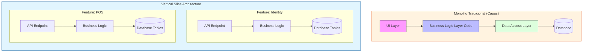
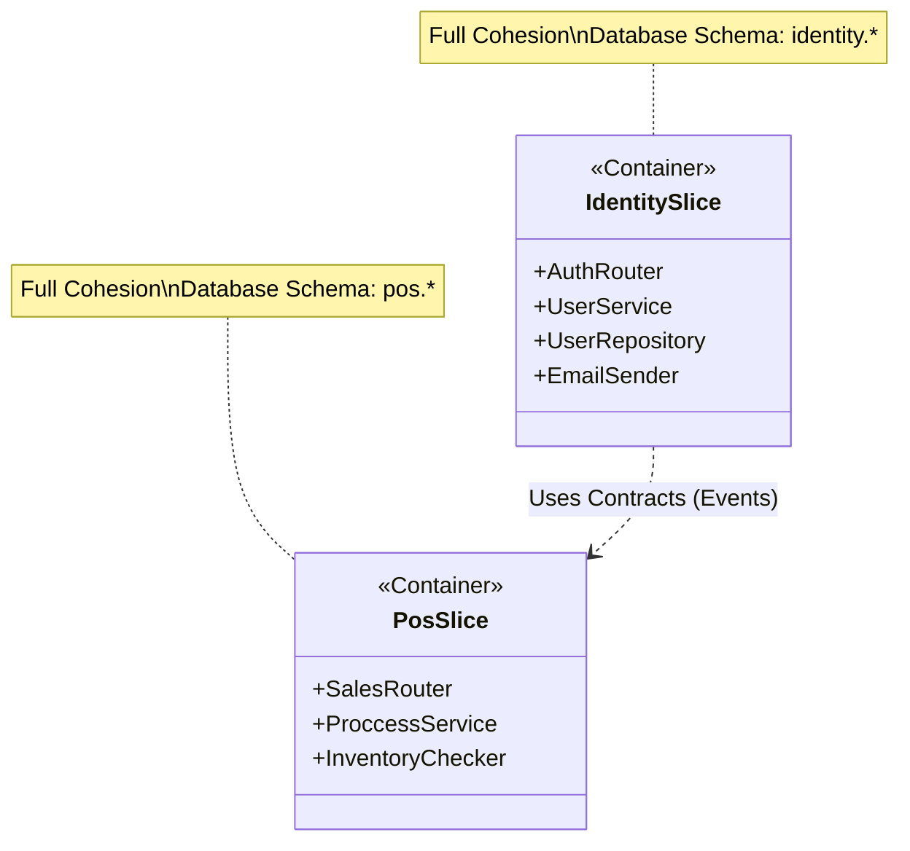
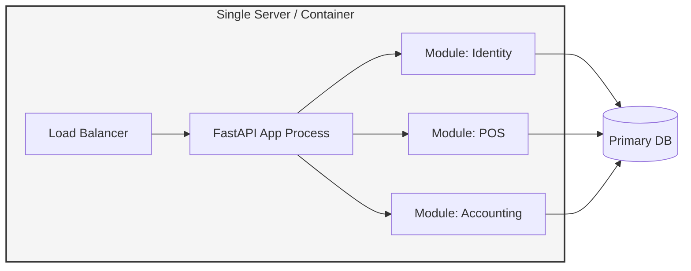

# Post 1: ¿Monolito o Microservicios? Por qué elegí un Monolito Distribuido con Vertical Slice 🚀

Muchos desarrolladores saltan prematuramente a los microservicios, enfrentándose a la complejidad de la red, latencia y gestión de datos distribuida demasiado pronto. En mi proyecto `finzapp_api`, decidí tomar un camino más pragmático: el **Monolito Distribuido con Vertical Slice Architecture**.

### 🏢 Contexto Real: Startup vs Complejidad
En startups en etapa temprana con recursos limitados, intentar orquestar docenas de microservicios en Kubernetes puede consumir hasta el 40% del tiempo de ingeniería. Se necesita la velocidad de iteración de un monolito, pero la modularidad suficiente para evitar deuda técnica. El "Monolito Distribuido" permite desplegar una sola unidad (ahorrando costos de nube y complejidad operativa) mientras se mantienen claros límites lógicos entre dominios como 'Identidad' y 'Operaciones', facilitando una futura extracción si fuera necesaria.

### 🛠️ El Enfoque pragmático
En lugar de dividir el sistema en servicios independientes con sus propias bases de datos (que a menudo termina en un "Distributed Monolith" mal hecho), organicé el código en **Slices Verticales** por dominio de negocio:

- `features/identity`
- `features/pos`
- `features/accounting`
- `features/products`

Cada "slice" contiene todo lo que necesita (routers, services, dtos, mappings) para cumplir una función específica de negocio.

### 🧩 Estructura Interna de un Slice
Cada Slice no es solo una carpeta; es un micro-componente completo. Así se ve por dentro:

### 🚢 Modelo de Despliegue Simplificado
A diferencia de los microservicios, el despliegue es atómico, pero la estructura es modular.

### ✅ Las Ventajas
1. **Baja Fricción**: Agregar una nueva funcionalidad no requiere tocar 10 capas diferentes. Todo está en su respectivo slice.
2. **Desacoplamiento**: Los slices se comunican mediante contratos claros y patrones como el **Observer**, evitando dependencias circulares.
3. **Escalabilidad**: Si mañana el módulo de `Accounting` crece demasiado, extraerlo a un microservicio es trivial, porque ya está lógicamente aislado.
4. **Agilidad**: Un solo desarrollador puede completar un feature de punta a punta sin "saltar" entre proyectos.

### 💡 Lección
La arquitectura no se trata de usar la tecnología más compleja, sino de elegir la que mejor equilibre la mantenibilidad y la velocidad de entrega. Empezar con un monolito bien estructurado suele ser mucho más eficiente que un sistema distribuido prematuro.

¿Tú qué prefieres: la simplicidad de un monolito bien estructurado o el poder (y dolor) de los microservicios desde el día 1? 👇

#SoftwareArchitecture #VerticalSlice #BackendDevelopment #CleanArchitecture #EngineeringExcellence
