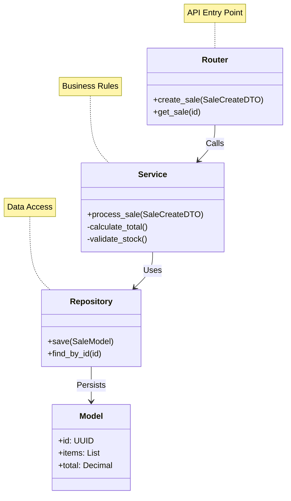
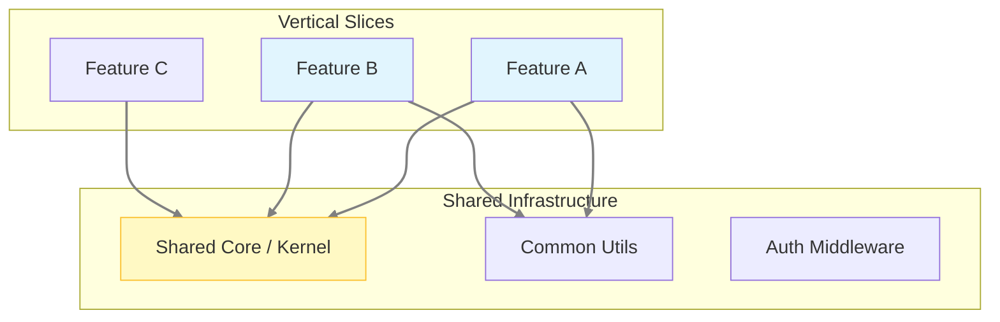
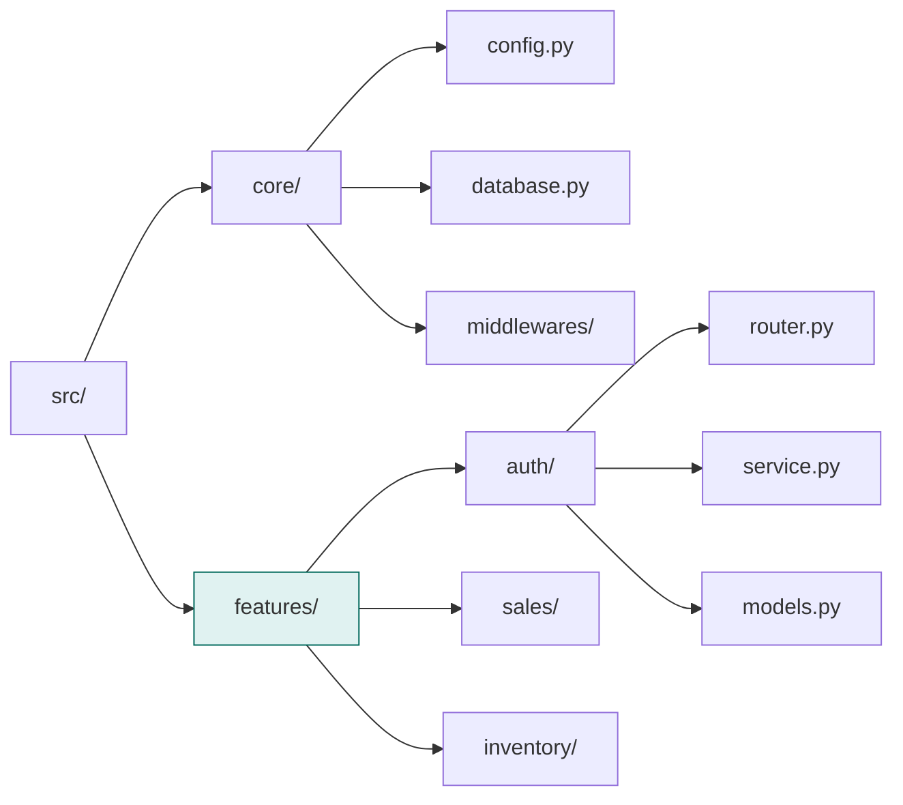

# Post 2: Vertical Slice Architecture: Adiós a las capas, hola a las funcionalidades 🍕

¿Alguna vez te has sentido como un ping-pong saltando entre carpetas de `controllers`, `services`, `models` y `repositories` solo para cambiar un campo en un API? 😫

En mi proyecto `finzapp_api`, decidí alejarme de la rigidez de la arquitectura tradicional por capas y adoptar **Vertical Slice Architecture**.

### 🏢 Contexto Real: Dominios Heterogéneos
En sistemas complejos, diferentes módulos tienen requisitos opuestos. Por ejemplo, un módulo de **Punto de Venta (POS)** requiere latencia ultra-baja y alta disponibilidad, mientras que un módulo de **Reportes** es un proceso batch pesado. En una arquitectura de capas tradicional, optimizar uno suele complicar al otro. Con Vertical Slice, es posible optimizar las queries y el caching de un módulo crítico al extremo sin tocar una sola línea de los módulos administrativos, ya que cada "slice" maneja su propio stack verticalmente de forma aislada.

### 📐 Vertical Slice vs. Clean/Hexagonal Architecture
Muchos proyectos fallan al implementar Clean o Hexagonal Architecture de forma dogmática, creando una "abstracción masiva" antes de entender el problema.

**¿Por qué elegí Vertical Slice sobre Clean Architecture?**
1. **Menos "Boilerplate" Inútil**: En Clean Architecture, a menudo terminas con interfaces y mappers que solo pasan datos de una capa a otra sin valor real. Vertical Slice elimina este ruido: si un feature es simple, se mantiene simple.
2. **Evita el Acoplamiento Horizontal**: En las arquitecturas por capas, los servicios suelen depender de otros servicios de su misma capa (o de capas adyacentes), creando una red de dependencias difícil de rastrear. En Vertical Slice, cada slice es una isla de funcionalidad.
3. **Optimizado para el Cambio**: El software cambia por requerimientos de negocio, no técnicos. Cambiar el "Punto de Venta" no debería requerir navegar por 4 capas horizontales.

### 🧠 Cohesión por Funcionalidad
En lugar de agrupar el código por su tipo técnico (todos los servicios juntos, todos los modelos juntos), el código se agrupa por su **función de negocio**. 

Así se ve mi estructura real:
```
src/features/pos/
├── routers/       # Exposición de la funcionalidad (API)
└── services/      # Lógica de negocio y orquestación
├── models/        # Representación de datos del feature
└── dtos/          # Contratos de entrada/salida
```



### 🕸️ Grafo de Dependencias: Shared Kernel vs Slices
El truco para no repetir código es tener un "Núcleo Compartido" delgado, del que todos dependen, pero nadie depende entre sí.



### 📂 Estructura Física del Proyecto
Así se ve el explorador de archivos en un proyecto real con esta arquitectura:



### 🚀 El Resultado
Un sistema que es **fácil de entender, rápido de escalar y trivial de refactorizar**. Si un dominio crece demasiado, ya está aislado y listo para ser extraído a su propio microservicio sin cirugía a corazón abierto. El código que cambia junto, vive junto.

### 💡 Lección
La arquitectura no es un dogma; es una herramienta. Elegir **Vertical Slice** demuestra un entendimiento profundo de que la mantenibilidad a largo plazo viene de una buena delimitación de responsabilidades de negocio, no de cuántas capas de abstracción puedas acumular.

¿Qué arquitectura usas en tus proyectos? ¿Crees que las capas tradicionales siguen siendo la mejor opción o te inclinas por los slices? 👇

#SoftwareArchitecture #VerticalSlice #CleanArchitecture #SystemDesign #Python #BackendDesign #EngineeringExcellence
