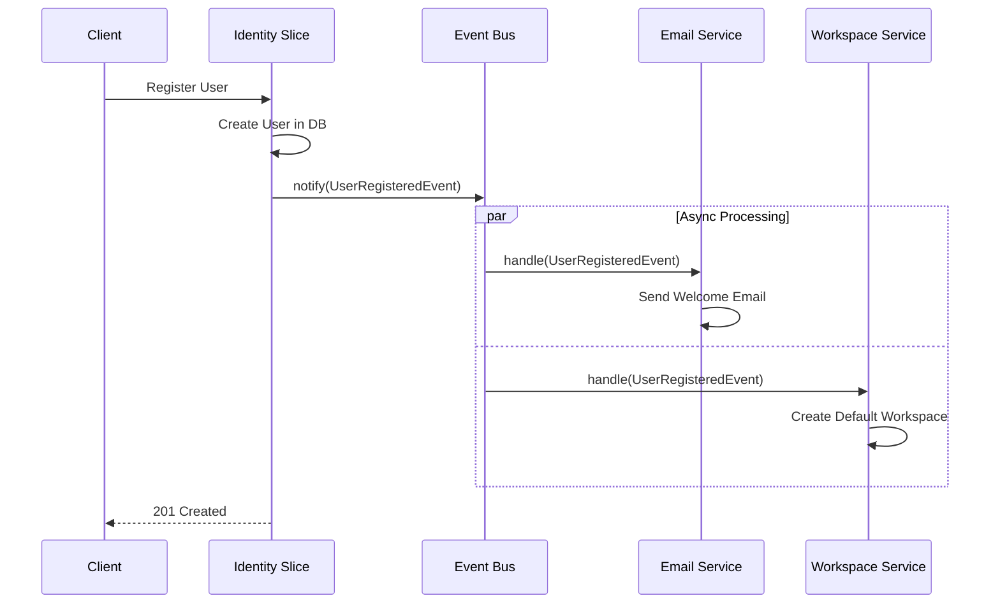
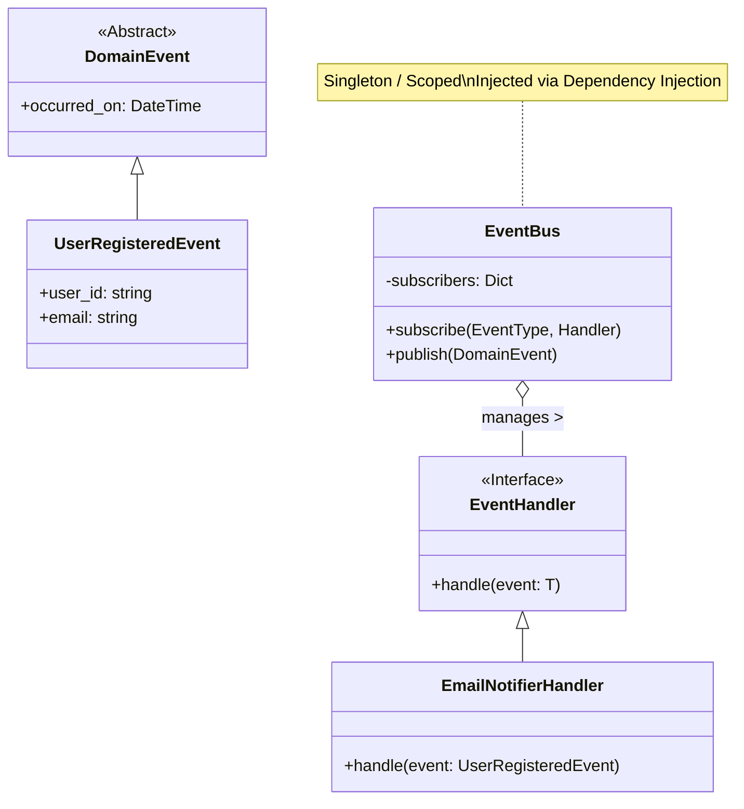

# Post 3: Patrón Observer: Desacoplando módulos como un Pro 🕵️‍♂️

Uno de los mayores retos en una arquitectura **Vertical Slice** (o en cualquier sistema grande) es cómo hacer que los módulos se comuniquen sin crear dependencias circulares o un "código espagueti" donde todos conocen a todos.

En `finzapp_api`, la solución fue el **Patrón Observer**.

### 🏢 Contexto Real: Procesos con Efectos Secundarios
En flujos críticos como el registro de usuarios, a menudo se acumulan requisitos secundarios: enviar correos de bienvenida, notificar a ventas, verificar listas de cumplimiento, etc. Acoplar todas estas llamadas dentro del servicio principal puede degradar severamente la performance y la fiabilidad (si el servicio de correo falla, el registro falla). Usando el patrón Observer, el proceso principal se mantiene rápido (ej. 200ms) y todos los efectos secundarios ocurren de manera asíncrona y desacoplada, sin bloquear al usuario ni poner en riesgo la transacción principal.

### 🧩 El Problema
Supongamos que cuando un usuario se registra (`Identity Slice`), necesitamos:
1. Enviar un correo de bienvenida.
2. Crear un espacio de trabajo inicial.
3. Notificar al equipo de ventas.

Si ponemos todo eso dentro de `UserService`, estamos violando el **Single Responsibility Principle**. El servicio de usuarios ahora "sabe" de correos, espacios de trabajo y ventas. ¡Un desastre! ❌

### ✨ La Solución: Observer Pattern
Implementé un sistema de eventos centralizado en `src/core/patterns/observer.py`. Así es como funciona:

1. **Defino el Evento**: `UserRegisteredEvent`.
2. **Registro Suscriptores**: 
   - `EmailService` se suscribe al evento.
   - `WorkspaceService` se suscribe al evento.
3. **Notifico**: Cuando el usuario se registra, el `UserService` simplemente "lanza" el evento al aire:
   ```python
   # En Identity Service
   self.notifier.notify(UserRegisteredEvent(user_id=new_user.id))
   ```



### 🏗️ Diseño de Clases (Event Bus)
La implementación interna utiliza tipos genéricos para asegurar que los eventos coincidan con sus manejadores.



### 🚀 Beneficios Senior
- **Extensibilidad**: Si mañana necesito añadir una cuarta acción al registro, NO toco el código del `Identity Slice`. Solo creo un nuevo suscriptor.
- **Testabilidad**: Puedo testear el registro de usuarios sin preocuparme por si el correo se envió o no.
- **Desacoplamiento Total**: Los módulos se comunican por contratos (eventos), no por implementaciones concretas.

### 💡 Lección Aprendida
El desacoplamiento no es solo una palabra de moda; es lo que evita que tu sistema colapse bajo su propio peso cuando crece. El **Patrón Observer** es tu mejor aliado para mantener una arquitectura limpia y modular.

¿Utilizas eventos para comunicar tus módulos o prefieres llamadas directas? Te leo en los comentarios. 👇

#DesignPatterns #ObserverPattern #CleanCode #SoftwareArchitecture #PythonBackend #Engineering
