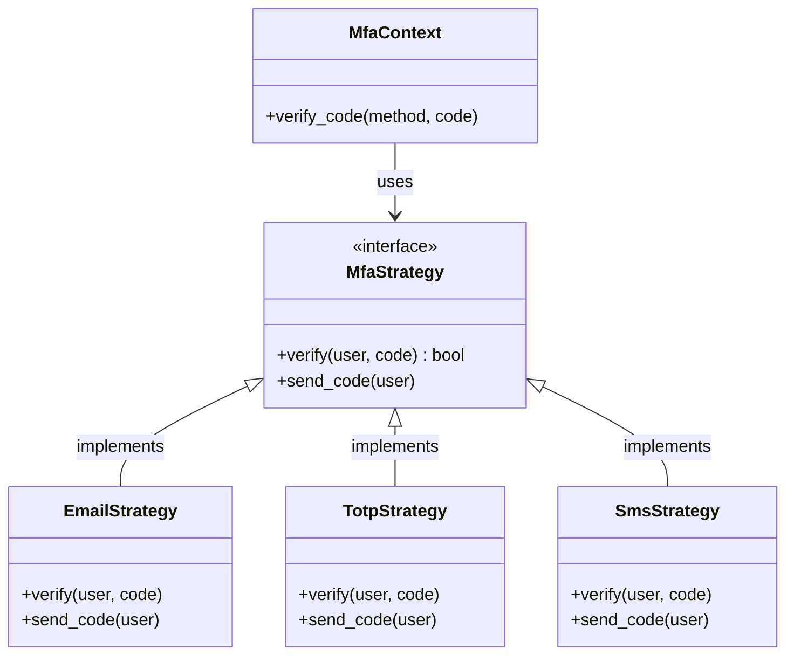
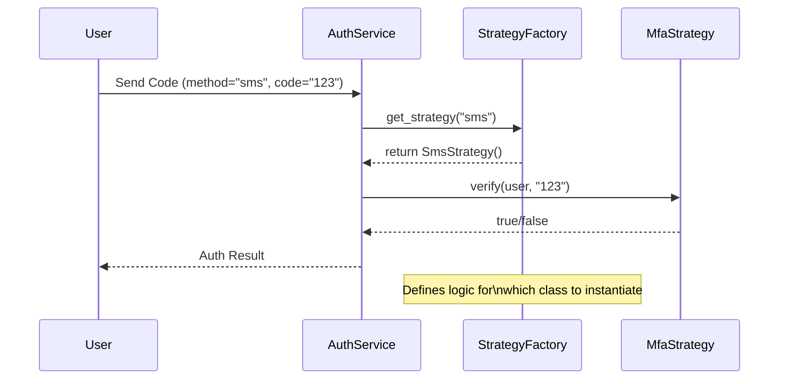

# Post 4: Patrón Strategy: Cómo manejar múltiples lógicas sin un "if" gigante 🧩

Imagina que tu aplicación necesita soportar varios métodos de autenticación de dos factores (MFA): Email, SMS, TOTP (Google Authenticator), y quizás biometría en el futuro.

¿Cómo lo implementas sin terminar con una función de 500 líneas llena de `if/else`? 🤯

La respuesta en `finzapp_api` fue el **Patrón Strategy**.

### 🏢 Contexto Real: Configuración Dinámica por Cliente
Cuando una aplicación SaaS debe soportar múltiples configuraciones de seguridad (ej. clientes corporativos que exigen TOTP/Google Authenticator vs. pequeños negocios que prefieren SMS o Email), el código puede llenarse rápidamente de condicionales `if/else`. Mantener esta lógica dispersa es insostenible. Con el patrón Strategy, el servicio de autenticación simplemente delega la acción de "verificar" a una fábrica que selecciona la estrategia correcta en tiempo de ejecución. Esto permite agregar nuevos métodos (como biometría) sin modificar el flujo principal de login, cumpliendo con el principio Open/Closed.

### 🛠️ El Abordaje "Naive" (Lo que NO hay que hacer)
```python
def verify_mfa(method, code):
    if method == "email":
        # Lógica de email...
    elif method == "totp":
        # Lógica de TOTP...
    # ... esto crece y crece
```
Este código viola el **Open/Closed Principle**: cada vez que añades un método, tienes que modificar la clase principal.

### ✨ La Solución: Strategy Pattern
Creamos una interfaz común y delegamos la ejecución a clases específicas:

1. **Interfaz**: `MfaStrategy` con el método `verify()`.
2. **Implementaciones**: `EmailMfaStrategy`, `TotpMfaStrategy`.
3. **Fábrica**: `MfaStrategyFactory` devuelve la estrategia correcta según la preferencia del usuario.



### ⏳ Resolución en Tiempo de Ejecución
Lo poderoso de este patrón es la decisión dinámica basada en la configuración del usuario.



### 🚀 Por qué es una decisión Senior
- **Flexibilidad**: Añadir un nuevo método de MFA es tan simple como crear una nueva clase que implemente `MfaStrategy` y registrarla. NO tocas el código existente.
- **Limpieza**: El `MfaService` solo sabe que tiene una "estrategia" y llama a `.verify()`. Le da igual si es un correo o un escaneo de retina.
- **Mantenedibilidad**: Cada lógica está aislada en su propio archivo, facilitando los tests unitarios.

### 💡 Conclusión
El Patrón Strategy convierte un flujo condicional complejo en un diseño elegante y extensible. Es la diferencia entre un código que se rompe al tocarlo y uno que evoluciona naturalmente.

¿Qué otros patrones usas para evitar los "if" infinitos en tu código? 👇

#DesignPatterns #StrategyPattern #CleanCode #Python #BackendDevelopment #MFA #Security
