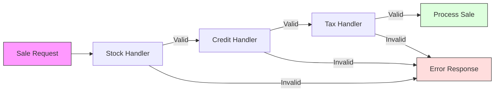
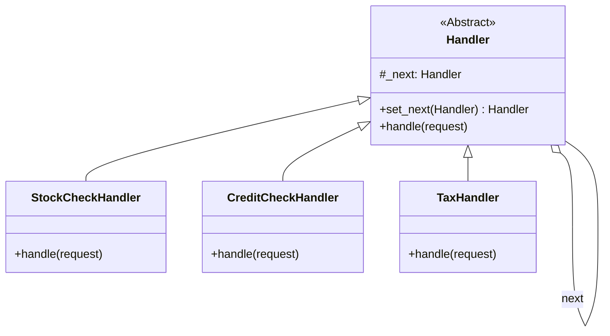

# Post 5: Chain of Responsibility: Validaciones y Middleware sin caos ⛓️

¿Tu lógica de validación se ve como una escalera de caracol de `if` anidados? ¿O tal vez tienes un set de reglas que cambian según el contexto?

En `finzapp_api`, implementamos el **Patrón Chain of Responsibility** para manejar procesos secuenciales de forma elegante.

### 🏢 Contexto Real: Pipelines de Aprobación Complejos
En dominios financieros, procesos como la aprobación de un crédito requieren pasar por múltiples filtros secuenciales: historial crediticio, flujo de caja, antigüedad, listas de fraude, etc. Hardcodear esta secuencia crea un código rígido y difícil de mantener. Usar "Chain of Responsibility" permite encapsular cada regla en un eslabón independiente. Esto facilita alterar el orden, agregar nuevas reglas (ej. "Verificación AI") o desactivar otras dinámicamente sin tocar el código base del procesador. Si un eslabón rechaza, la cadena se detiene y devuelve la razón exacta, manteniendo la lógica limpia y modular.

### 🧩 El Concepto
Imagina que para procesar una venta en el POS, necesitas pasar por varios filtros:
1. Validar stock.
2. Validar crédito del cliente.
3. Aplicar descuentos por temporada.
4. Validar impuestos regionales.

En lugar de tener una clase "Dios" que haga todo, creamos una "cadena" de eslabones independientes.

### ✨ La Implementación
Cada "handler" en la cadena tiene una única responsabilidad:
- Si puede procesar la petición y detener la cadena, lo hace.
- Si no, la pasa al siguiente eslabón.

```python
# Ejemplo conceptual basado en src/core/patterns/chain.py
stock_handler.set_next(credit_handler).set_next(tax_handler)
stock_handler.handle(sale_request)
```



### 🏗️ Arquitectura de Clases
El secreto está en la clase abstracta que maneja el puntero `_next`.



### 🚀 Ventajas de Arquitectura Senior
- **Single Responsibility**: Cada validador solo se encarga de una regla.
- **Dynamic Chains**: Puedes construir diferentes cadenas en tiempo de ejecución según el tipo de cliente o de venta.
- **Desacoplamiento**: El cliente que inicia la petición no sabe cuántos pasos hay en la cadena ni qué eslabones la componen.

### 💡 Lección
La **Chain of Responsibility** es ideal cuando tienes un proceso que consiste en varios pasos de procesamiento o validación que pueden variar. Es la base de muchos middlewares modernos y una herramienta poderosa para mantener el código "S" (Solid).

¿Conocías este patrón o prefieres usar decoradores o interceptores? 👇

#DesignPatterns #ChainOfResponsibility #CleanCode #SoftwareArchitecture #PythonDev #Backend
