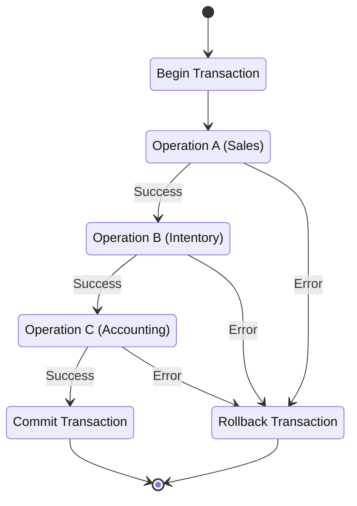
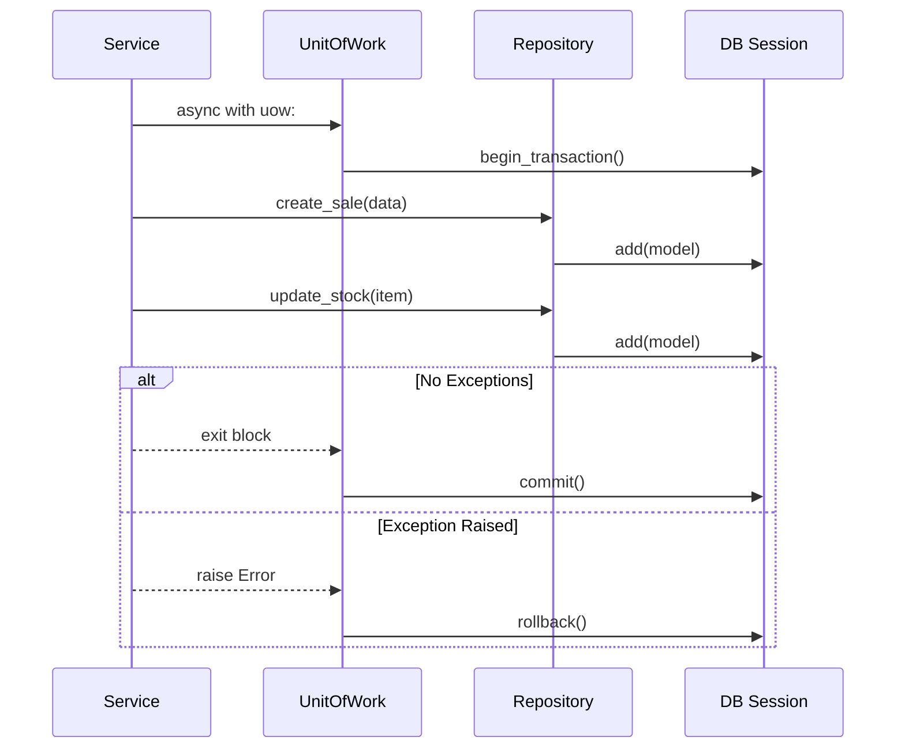

# Post 6: Unit of Work: Garantizando la consistencia en un mundo distribuido ⚛️

### 🏢 Contexto Real: Consistencia Transaccional
En procesos de checkout complejos que involucran múltiples sistemas (ej. Ordenes, Inventario, Pagos), un fallo parcial puede ser catastrófico (cobrar al usuario pero no reservar el producto). El patrón Unit of Work asegura que todas las operaciones de base de datos dentro de una solicitud de negocio se traten como una transacción atómica indivisible: **TODO** ocurre o **NADA** ocurre. Esto elimina la necesidad de limpiezas manuales y garantiza la integridad de los datos en escenarios de fallo.

### 💼 El Problema de la Inconsistencia

Cuando trabajas con múltiples repositorios en un mismo "Use Case", uno de los mayores peligros es que la mitad de las operaciones tengan éxito y la otra mitad fallen. Esto deja tu base de datos en un estado inconsistente y te regala pesadillas en producción. 😱

En `finzapp_api`, implementamos el **Patrón Unit of Work** para asegurar la atomicidad.

### 🧩 El Problema
Supongamos que al procesar una venta:
1. Registras el `Sale`.
2. Actualizas el `Inventory`.
3. Creas una `AccountingTransaction`.

Si la actualización del inventario falla después de haber creado la venta, ¿qué haces? ¿Borras la venta a mano? Eso es el camino al desastre.

### ✨ La Solución: Unit of Work
El Patrón Unit of Work actúa como un gestor de transacciones que coordina múltiples repositorios. Todo lo que sucede dentro de una "unidad de trabajo" se confirma (commit) o se deshace (rollback) como un solo bloque.

```python
# Ejemplo conceptual basado en src/core/unit_of_work.py
async with unit_of_work:
    await unit_of_work.sales.create(sale_data)
    await unit_of_work.inventory.update_stock(product_id, quantity)
    await unit_of_work.accounting.post_transaction(account_id, amount)
    # Si llegamos aquí, se hace COMMIT automático.
    # Si ocurre una excepción, se hace ROLLBACK automático.
```



### 🔄 Flujo de Interacción
La magia ocurre en el `__aexit__` del contexto, donde se decide el destino de la transacción.



### 🚀 Por qué es un Skill Senior
- **Atomicidad (Do or Die)**: Garantiza que el sistema nunca esté en un estado parcial.
- **Transparencia**: Los servicios no tienen que saber de sesiones de bases de datos o transacciones SQL. Solo usan la unidad de trabajo.
- **Testabilidad**: Es mucho más fácil mockear una unidad de trabajo que múltiples sesiones de DB dispersas por todo el código.

### 💡 Lección de Arquitectura
La integridad de los datos es sagrada. El Patrón Unit of Work no solo hace tu código más limpio, sino que protege el activo más valioso de cualquier empresa: su información.

¿Utilizas Unit of Work o manejas las transacciones directamente en tus servicios? Comparte tu enfoque. 👇

#UnitOfWork #DataIntegrity #BackendArchitecture #DDD #Python #PostgreSQL #SoftwareEngineering
