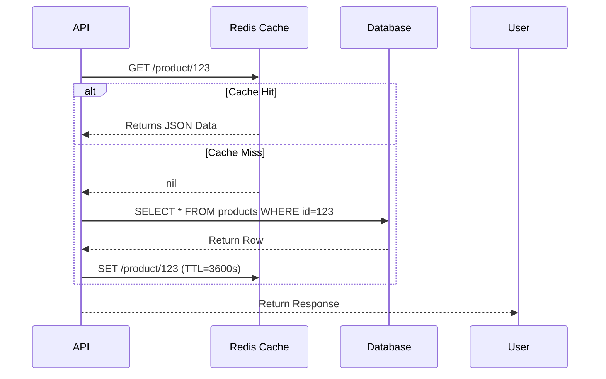
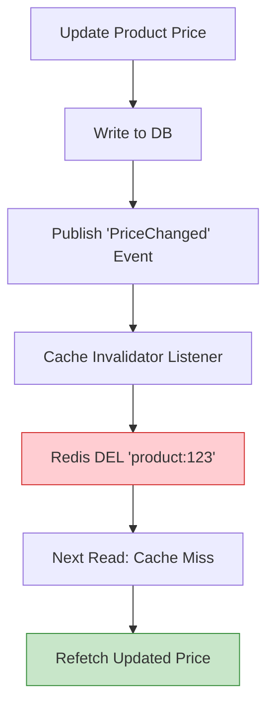

# Post 7: Redis Caching: Llevando el rendimiento al siguiente nivel ⚡

En un sistema de alta disponibilidad, la base de datos suele ser el cuello de botella. No importa qué tan limpia sea tu arquitectura si tu API tarda 2 segundos en responder porque la DB está saturada.

En `finzapp_api`, implementamos una estrategia robusta de **Caching con Redis** para mantener latencias bajas y usuarios felices.

### 🏢 Contexto Real: Lectura vs Escritura
En sistemas de comercio electrónico, el catálogo de productos se consulta miles de veces por minuto, mientras que los precios e inventarios cambian con poca frecuencia. Consultar la base de datos relacional para cada vista de producto es ineficiente y costoso. Implementando una estrategia de Cache-Aside con Redis, se puede reducir la carga de la base de datos primaria en más de un 90% y reducir la latencia de lectura a milisegundos, reservando la base de datos SQL para operaciones de escritura críticas.

### ⚡ Estrategia de Cache "Cache-Aside" Pattern
No cacheamos "porque sí". Seguimos un patrón claro:
1. **Consulta**: ¿Está el dato en Redis?
2. **Hit**: Si está, lo devolvemos instantáneamente.
3. **Miss**: Si no está, lo buscamos en la DB, lo guardamos en Redis con un TTL (Time To Live) y lo devolvemos.

### 🛠️ Implementación Senior
Lo interesante no es solo usar Redis, sino *cómo* lo usamos:
- **Serialización Eficiente**: Usamos DTOs para asegurar que los datos guardados en cache sean consistentes.
- **Invalidación Inteligente**: Cuando un dato cambia (ej. el precio de un producto), el cache correspondiente se invalida de inmediato para evitar datos "viejos".
- **Global Config**: Centralizamos la conexión y los decoradores en `src/core/redis_cache.py`.

### ✅ Beneficios Tangibles
1. **Latencia < 50ms**: Para las consultas más comunes.
2. **Escalabilidad**: La DB ahora solo trabaja en lo que realmente importa (escrituras y reportes complejos).
3. **Resiliencia**: Si la DB tiene un pico de carga, el cache sigue sirviendo las lecturas más frecuentes.

### 💡 Lección
El rendimiento es una feature. Como ingenieros senior, debemos diseñar sistemas que no solo funcionen correctamente, sino que se sientan instantáneos para el usuario final.

¿Cuál es tu estrategia favorita para invalidar cache? ¿TTL corto o invalidación por eventos? 🤔

#Redis #Performance #Backend #PythonDev #Scalability #SystemDesign #Caching
