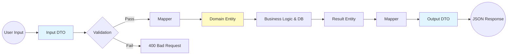
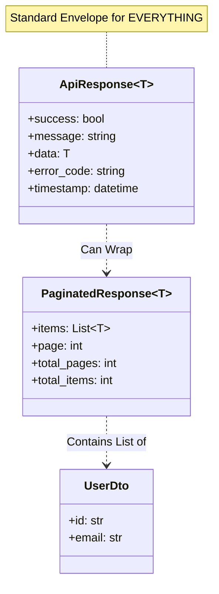

# Post 8: Backend Design Systems: Porque el buen código es predecible 📐

### 🏢 Contexto Real: Consistencia en Equipos Distribuidos
Cuando múltiples desarrolladores o equipos trabajan en la misma API, es común que surjan inconsistencias en los formatos de respuesta (unos usan `error`, otros `msg`, otros códigos HTTP incorrectos). Esto crea fricción constante con los equipos de frontend y mobile, que deben escribir adaptadores para cada endpoint. Implementar un `Backend Design System` que fuerce una estructura de respuesta estandarizada (ej. `ApiResponse<T>`) reduce drásticamente el tiempo de integración y elimina la ambigüedad en la comunicación entre cliente y servidor.

A menudo hablamos de "Design Systems" en el frontend (componentes, colores, tipografía). ¿Pero qué pasa con el backend? Un backend senior también necesita un **Design System** que asegure consistencia, seguridad y velocidad de desarrollo.

En `finzapp_api`, establecimos reglas claras para que cualquier desarrollador sepa qué esperar de cada endpoint.

### 🧱 Los Pilares del Backend Design System
1. **DTOs (Data Transfer Objects)**: Nada entra ni sale del API sin pasar por un DTO. Esto protege nuestro dominio y actúa como un contrato inquebrantable con el frontend.
2. **Auto-Mapping**: Usamos mappings para transformar entidades de DB a DTOs. Esto evita que los cambios en la base de datos rompan el API y viceversa.
3. **Control de Errores Unificado**: Todos los errores (validación, base de datos, lógica) se capturan y se devuelven en un formato JSON consistente. Se acabaron los errores 500 crípticos. ❌
4. **Tipado Estricto**: Python con Type Hints y validaciones automáticas asegura que los errores se detecten en tiempo de desarrollo, no en producción.

### 🚀 Por qué importa
Un backend predecible es un backend feliz. Cuando el equipo conoce los estándares:
- Las revisiones de código son más rápidas.
- El onboarding de nuevos miembros es sencillo.
- La integración con el frontend es fluida y sin sorpresas.

### 💡 Consejo Final
La excelencia en ingeniería no se demuestra haciendo cosas complejas, sino haciendo que las cosas complejas parezcan simples y consistentes. Los estándares son la base de la escalabilidad.

¿Tienes un "Design System" o guia de estilos en tu backend? 👇

#SoftwareEngineering #CleanCode #DTO #Python #BackendStandard #EngineeringExcellence #API
