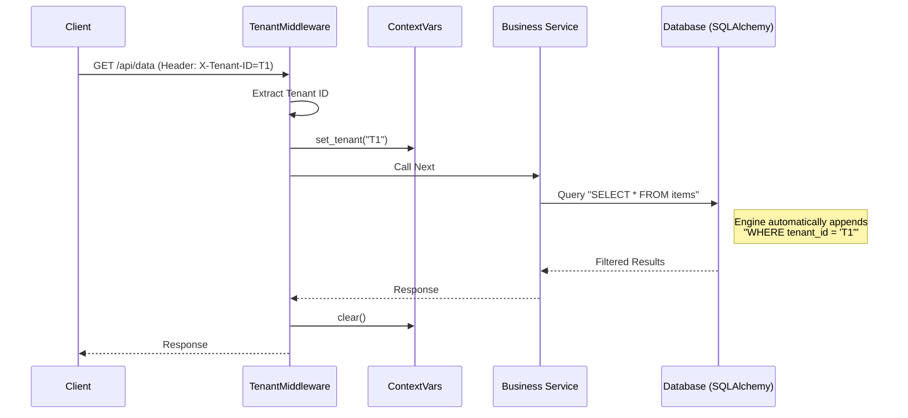

# Post 9: Multi-tenancy: Gestionando contextos de negocio con Middlewares 🏢

Cuando construyes una plataforma SaaS (Software as a Service), uno de los mayores desafíos es el **Multi-tenancy**: cómo asegurar que los datos de la Empresa A nunca se mezclen con los de la Empresa B, manteniendo una sola base de datos y un solo API.

En `finzapp_api`, implementé una solución elegante basada en **Middlewares de Contexto**.

### 🏢 Contexto Real: Aislamiento de Datos en SaaS
En aplicaciones SaaS B2B Multi-tenant, el riesgo de "filtración de datos" (que un cliente vea los datos de otro) es inaceptable. Confiar en que cada desarrollador recuerde agregar un filtro `WHERE tenant_id = X` en cada consulta SQL es propenso a errores humanos fatales. La solución robusta es implementar un Middleware que intercepte el contexto del tenant desde el token de autenticación e inyecte filtros automáticamente a nivel de repositorio o base de datos (Row Level Security), garantizando un aislamiento de datos invisible y a prueba de olvidos.

### 🏗️ El Reto del SaaSenior: Tenant Isolation
En lugar de pasar el `tenant_id` manualmente en cada función de cada servicio (lo cual es propenso a errores y genera código sucio), usamos el poder de los Middlewares.

### ✨ Cómo funciona: `tenant_context.py`
1. **Identificación**: El middleware intercepta cada petición y extrae el ID del negocio clientes (ya sea por un Header, un subdominio o el Token JWT).
2. **Contexto Seguro**: Usamos `contextvars` (o similares) para guardar este ID en el hilo de ejecución actual.
3. **Filtro Automático**: Todos los servicios y repositorios consultan este contexto global para filtrar las queries automáticamente.

```python
# Resumen conceptual del middleware
async def tenant_middleware(request: Request, call_next):
    tenant_id = request.headers.get("X-Tenant-ID")
    if not tenant_id:
        raise TenantNotFoundException()
    
    with set_tenant_context(tenant_id):
        return await call_next(request)
```



### 🏗️ Arquitectura de Base de Datos (Pool Compartido)
Usamos un enfoque de "Discriminator Column" reforzado por RLS (Row Level Security) o filtros de aplicación.

```mermaid
graph TD
    subgraph "App Layer"
        Req[Request T1] --> Mid[Middleware]
        Mid --> Repo[Repository]
    end
    
    subgraph "Data Layer"
        Repo --> Conn[DB Connection (Role: AppUser)]
        
        subgraph "Single Database"
            Table[Table: Sales]
            Row1[Row: Tenant 1 Data]
            Row2[Row: Tenant 2 Data]
            Row3[Row: Tenant 1 Data]
        end
    end
    
    Conn -.->|Enforces Filter| Table
    
    style Row1 fill:#c8e6c9
    style Row3 fill:#c8e6c9
    style Row2 fill:#ffcdd2
```

### 🚀 Por qué es una Decisión Senior
- **Seguridad por Diseño (Security by Design)**: Es casi imposible olvidar filtrar por tenant, porque el sistema lo hace a nivel de infraestructura.
- **Código Limpio**: La lógica de negocio no tiene que preocuparse por "quién es el dueño" de los datos; solo se enfoca en "qué hacer" con ellos.
- **Escalabilidad Administrativa**: Puedes añadir miles de negocios nuevos sin cambiar una sola línea de lógica central.

### 💡 Lección
El aislamiento de datos no debe ser una idea de último momento. Diseñar con Multi-tenancy desde el día 1, usando middlewares de contexto, separa a los desarrolladores Jr de los ingenieros de sistemas Senior.

¿Cómo manejas el aislamiento de datos en tus proyectos SaaS? 👇

#MultiTenancy #SaaS #BackendArchitecture #Python #FastAPI #CloudComputing #SystemDesign
