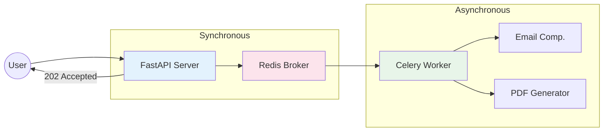
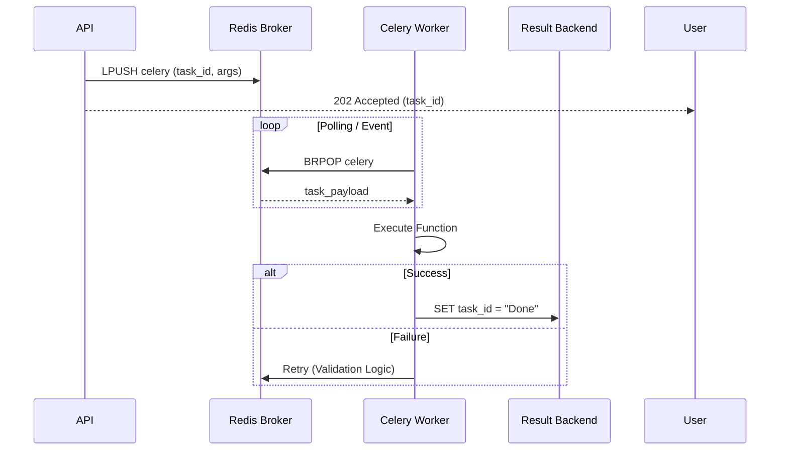

# Post 10: Offloading: Libera tu API del trabajo pesado con Celery 🧠

Nada mata más rápido la experiencia de usuario que un "spinner" infinito esperando a que el servidor envíe un correo o genere un reporte PDF complejo.

En un sistema Senior como `finzapp_api`, las peticiones lentas no bloquean al usuario. Usamos **Celery + Redis** para delegar el trabajo pesado al fondo.

### 🏢 Contexto Real: Operaciones Bloqueantes
Generar reportes masivos (ej. estados de cuenta mensuales en PDF) es una operación intensiva en CPU y I/O que puede tardar varios segundos o minutos. Ejecutar esto en el hilo principal de una petición HTTP bloquea el servidor y causa timeouts, degradando la experiencia de todos los usuarios. Mover estas tareas a una cola de trabajos en segundo plano (como Celery) permite devolver una respuesta inmediata al usuario ("Tu reporte se está procesando") y liberar al servidor web para seguir atendiendo tráfico, mejorando la escalabilidad y la percepción de velocidad.

### 🐢 El Problema de las Tareas Pesadas procesar, es para responder
Si tu endpoint `/register` espera a que el servidor de correo responda para devolver un "OK", tienes un sistema frágil. Si el servidor de correo falla o tarda 5 segundos, tu usuario sufre.

### ✨ La Solución: Arquitectura Asíncrona
Implementamos un sistema de colas donde el API solo "deja el recado" y responde de inmediato.

1. **Worker Celery**: Un proceso independiente que escucha tareas.
2. **Message Broker (Redis)**: La mensajería donde el API deja las instrucciones.
3. **Tasks**: Funciones decoradas que se ejecutan fuera del flujo principal (vistas en `src/core/tasks/`).

```python
# En el API
async def create_report(data):
    # En lugar de esperar el PDF, lanzamos la tarea
    return {"status": "Processing", "job_id": data.id}
```



### ⏱️ Ciclo de Vida de una Tarea
El usuario recupera el control inmediatamente, mientras la tarea viaja por el sistema.



### 🚀 Beneficios Senior
- **User Experience (UX)**: Respuesta instantánea para el cliente.
- **Resiliencia**: Si el Worker falla, Celery puede reintentar la tarea automáticamente sin que el API se vea afectado.
- **Escalabilidad**: ¿Tienes muchos reportes? Solo añade más Workers en otros servidores. El API sigue volando.
- **Limpieza**: La lógica pesada (como generar Excel con miles de filas) vive aislada de los controladores.

### 💡 Lección de Oro
Un Ingeniero Senior sabe que el tiempo del usuario es sagrado. Si una tarea tarda más de 200ms y no es crítica para la respuesta inmediata, **mándala al fondo**.

¿Qué tareas has movido a procesos en segundo plano últimamente? ¿Celery, RQ o simples hilos? 👇

#Celery #Python #DistributedSystems #Backend #Architecture #Redis #Performance #UX
