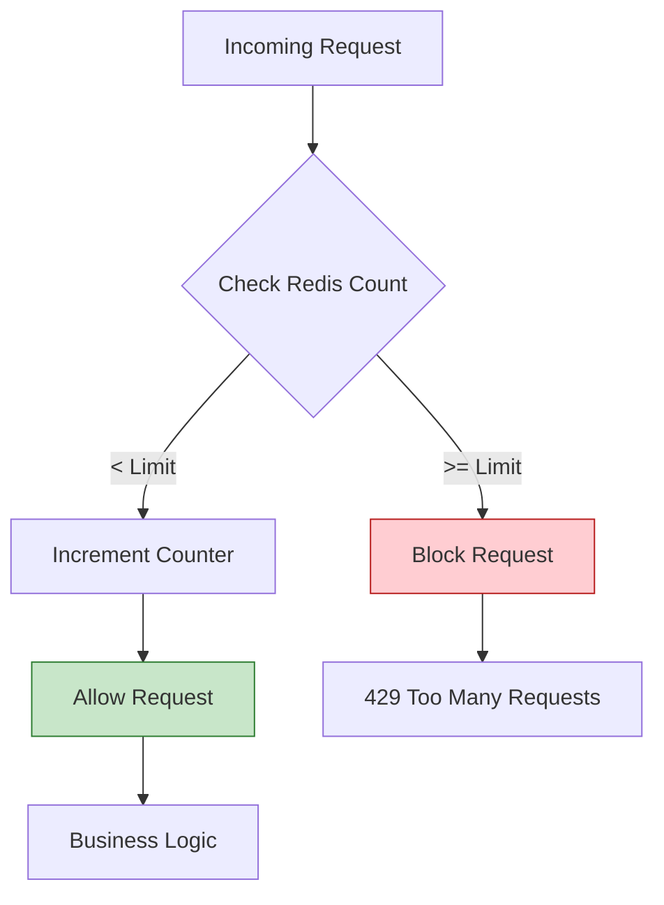
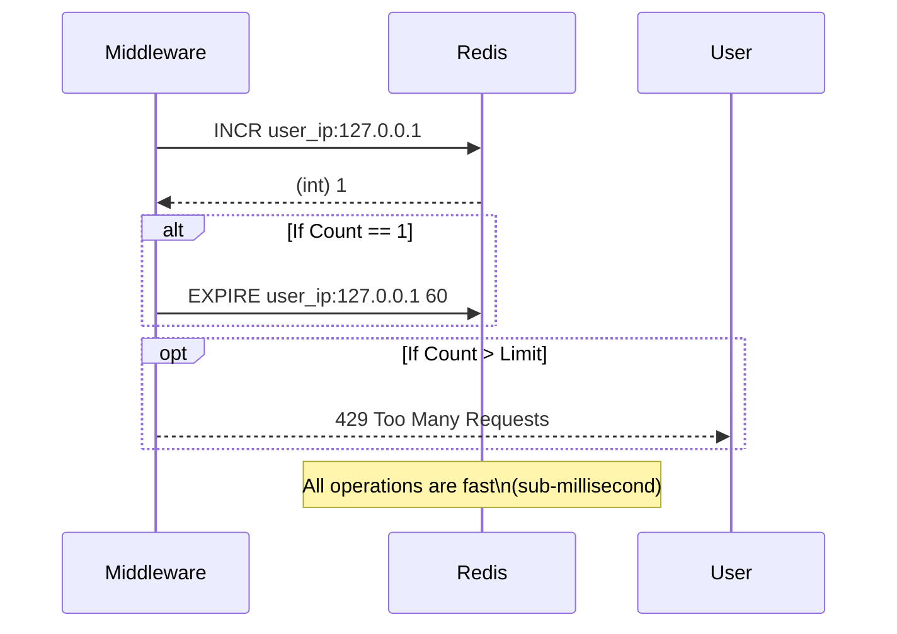

# Post 11: Rate Limiting: Protegiendo tu infraestructura de abusos (y de ti mismo) 🛡️

¿Qué pasa si un bot decide atacar tu endpoint de login? ¿O si un error en el frontend de un cliente genera miles de peticiones accidentales por segundo? 😱

Sin protección, tu base de datos y tu presupuesto de nube podrían colapsar en minutos. En `finzapp_api`, implementamos **Rate Limiting dinámico** como primera línea de defensa.

### 🏢 Contexto Real: Protección contra Abusos
Los ataques de "Credential Stuffing" (bots probando miles de contraseñas filtradas) son una amenaza constante para cualquier API pública. Sin limitación, un ataque de este tipo puede saturar la base de datos y denegar el servicio a usuarios legítimos. Implementar Rate Limiting le permite al sistema defenderse automáticamente, permitiendo por ejemplo solo 5 intentos fallidos por IP cada 10 minutos, neutralizando bots sin afectar la experiencia de los usuarios reales.

### 🧱 El Guardián: `rate_limit.py`
Usamos un Middleware que actúa antes de que la petición llegue siquiera a la lógica de negocio.

1. **Memoria de Elefante (Redis)**: Redis es perfecto para esto porque es extremadamente rápido. Guardamos el conteo de peticiones de cada IP o Usuario.
2. **Algoritmo de Ventana Deslizante (Sliding Window)**: No solo bloqueamos por "X peticiones por minuto", sino que analizamos el tráfico en tiempo real para ser justos con los usuarios legítimos.
3. **Respuesta Clara**: Cuando alguien supera el límite, devolvemos un código `429 Too Many Requests` con el header `Retry-After`.

```python
# Lógica conceptual del Rate Limiter
limit = 100  # peticiones por minuto
current_usage = await redis.get(user_key)

if current_usage >= limit:
    raise RateLimitExceededException()
else:
    await redis.incr(user_key)
```



### ⏳ Atomicity in Motion
El uso de scripts LUA o comandos atómicos en Redis es clave para evitar condiciones de carrera.



### 🚀 Por qué es un Skill de "System Design" Senior
- **Protección de Costos**: Evita que peticiones basura consuman recursos por los que pagas (CPU, DB, Ancho de banda).
- **Disponibilidad (DoS Protection)**: Asegura que el API esté disponible para todos, repartiendo el "ancho de banda" de peticiones de forma equitativa.
- **Diferenciación de Servicios**: Podemos dar límites más altos a usuarios Premium y límites estrictos a usuarios anónimos o en periodo de prueba.

### 💡 Lección
Un sistema profesional no solo es aquel que funciona bien bajo condiciones normales, sino aquel que **se protege a sí mismo** bajo condiciones anómalas. El Rate Limiting no es opcional en una arquitectura de alta calidad.

¿Tienes límites de peticiones en tu API o confías en la buena voluntad de tus clientes? 👇

#RateLimiting #Redis #BackendSecurity #APIDesign #SystemDesign #Python #CyberSecurity #Performance
