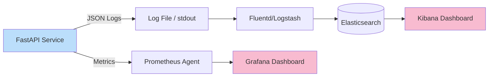

# Post 13: Observabilidad: No esperes a que el cliente te avise de un error 👁️

Como Ingeniero Senior, tu peor pesadilla no es un bug; es un bug en producción del que no te enteras hasta que un cliente furioso llama a soporte. 📞🔥

En `finzapp_api`, construimos un sistema con **Observabilidad** desde el núcleo para saber qué está pasando en tiempo real.

### 🧱 Los 3 Pilares de la Observabilidad
1. **Logging Estructurado**:### 🏢 Contexto Real: Depuración en Distribución
En picos de tráfico (como Black Friday), los tiempos de respuesta pueden degradarse por cuellos de botella inesperados (ej. un proveedor de SMS tardando más de lo normal). Sin logs estructurados ni trazabilidad distribuida, encontrar la causa raíz en gigabytes de logs de texto plano es buscar una aguja en un pajar. El uso de `Correlation IDs` que viajan a través de todos los servicios permite filtrar y visualizar la traza completa de una petición, reduciendo el tiempo de diagnóstico de horas a minutos.

### 🕵️‍♂️ Más allá del `print("error")` y logs de texto simple. Usamos JSON logging para facilitar la búsqueda y filtrado en herramientas como ELK o Datadog. Cada log incluye un `correlation_id` para rastrear una petición a través de todo el sistema.
2. **Métricas de Performance**: Medimos el tiempo de respuesta de cada endpoint y la salud de la base de datos. Si una query a `Accounting` tarda más de lo habitual, lo sabemos de inmediato.
3. **Monitoreo de Salud (Health Checks)**: Endpoints dedicados para que el orquestador sepa si el servicio está listo para recibir tráfico o si necesita reiniciarse.

### ✨ La Pieza Clave: `monitoring.py`
Implementamos un Middleware de monitoreo que captura automáticamente:
- Códigos de estado (2xx, 4xx, 5xx).
- Latencia de la petición.
- Errores no capturados con su stack trace completo.



### 🔗 Trazabilidad Distribuida (Correlation ID)
¿Cómo sabes que el error en la DB vino de ese click específico del usuario?

```mermaid
graph TD
    Client[Client App] -->|X-Request-ID: abc-123| LB[Load Balancer]
    LB -->|X-Request-ID: abc-123| API[FastAPI Middleware]
    
    API -->|Context| Logic[Service Logic]
    Logic -->|Log Record| Log1[Log: "Processing"]
    Logic -->|Log Record| Log2[Log: "Error!"]
    
    Log1 -.->|Contains ID| Aggregator
    Log2 -.->|Contains ID| Aggregator
    
    style Log2 fill:#ffcdd2
```

### 🚀 Por qué importa a nivel Senior
- **Mantenibilidad**: Reduce el tiempo medio de reparación (MTTR).
- **Confianza**: Te da datos reales para tomar decisiones de escalabilidad.
- **Profesionalismo**: Demuestra que valoras la estabilidad y la experiencia del usuario por encima de todo.

### 💡 Lección
Si no puedes medirlo, no puedes mejorarlo. La observabilidad es lo que diferencia a una aplicación de "juguete" de un sistema empresarial robusto.

¿Qué herramientas usas para monitorear tus APIs en producción? ¿Grafana, Sentry, CloudWatch? 👇

#Observability #DevOps #Backend #SRE #Python #Monitoring #Logging #SoftwareEngineering
