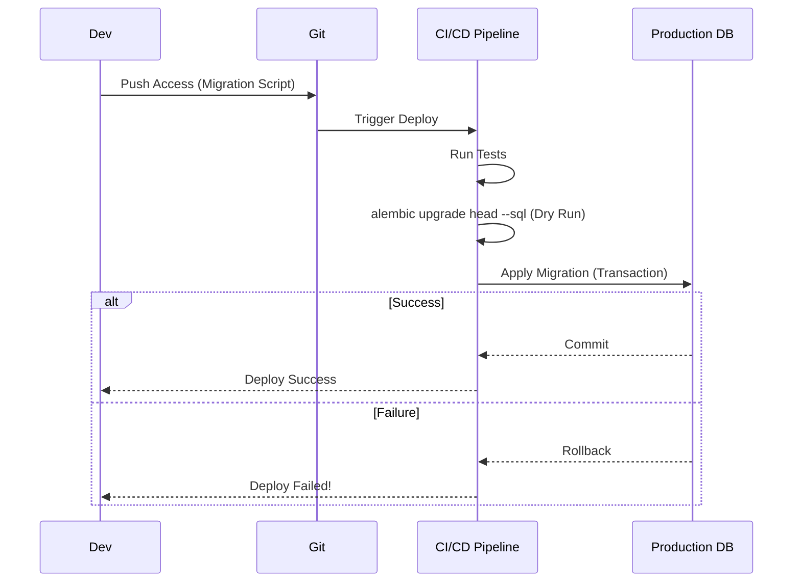
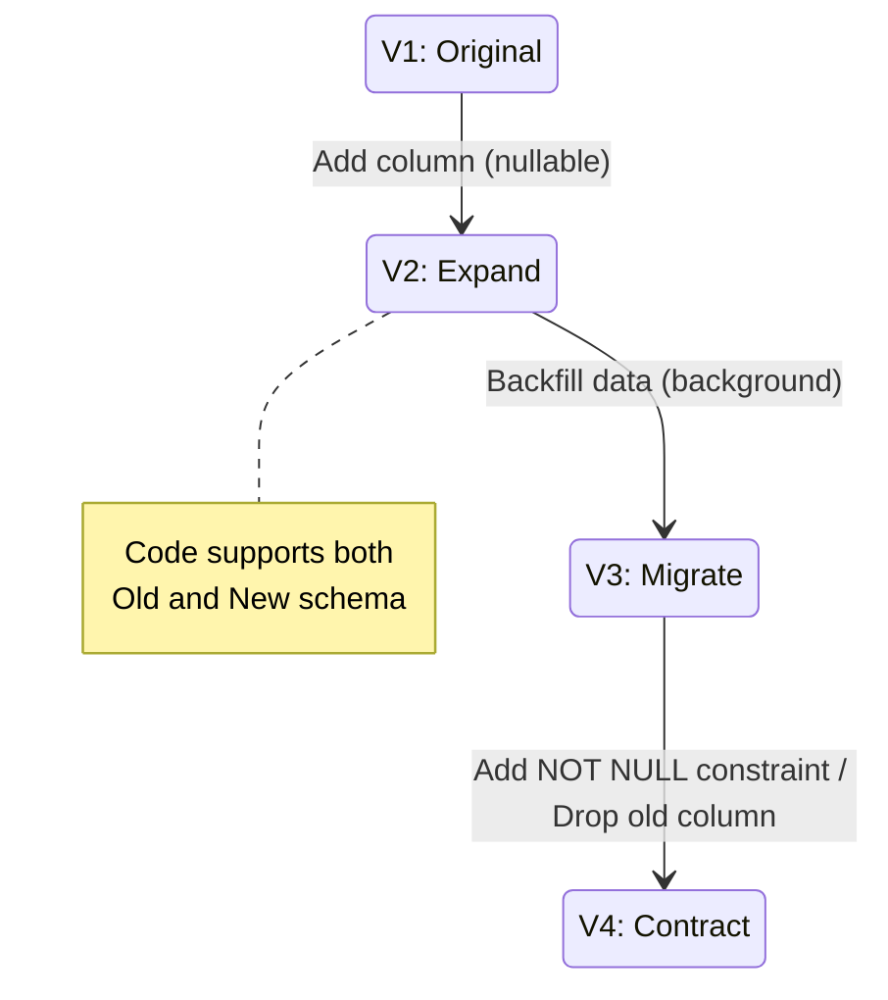

# Post 14: Migrations: Cambiando el corazón de tu DB sin miedo (ni downtime) 💓

¿Te ha pasado que tienes miedo de correr una migración en producción porque podría romperlo todo o bloquear las tablas durante horas? 😰

En un entorno Senior, los cambios en la base de datos se gestionan con rigor y herramientas de control de versiones. En `finzapp_api`, usamos **Alembic** para asegurar que cada evolución del esquema sea predecible y segura.

### 📐 Por qué no basta con SQL plano
Gestionar migraciones a mano es una receta para el desastre en equipos de más de una persona. Con Alembic:
1. **Control de Versiones**: Cada cambio es un archivo en Git. Sabemos quién, qué y cuándo cambió algo.
2. **Rollbacks**: Si algo sale mal, podemos volver a la versión anterior en segundos.
3. **Automatización**: Las migraciones se ejecutan como parte del pipeline de CI/CD, eliminando el error humano.

### ✨ Estrategia Senior: Zero Downtime Migrations
No solo se trata de correr el comando `upgrade`. Para sistemas de alta disponibilidad, seguimos reglas de oro:
- **Evitado de Bloqueos**: No borramos columnas directamente ni cambiamos tipos de datos que requieran reescribir la tabla entera.
- **Migraciones Aditivas**: Primero añadimos la nueva columna, migramos los datos en segundo plano y luego (en otra versión) borramos la vieja.
- **SQL Preview**: Siempre revisamos el SQL generado antes de aplicarlo.

### 🏢 Contexto Real: Migraciones sin Downtime
Modificar tablas con millones de registros (ej. agregar una columna `NOT NULL` por defecto) suele bloquear la tabla completa, deteniendo el servicio para todos los usuarios. En sistemas de alta disponibilidad, esto es inaceptable. La estrategia correcta es aplicar el patrón "Expand-Migrate-Contract": primero agregar la columna como nullable (instantáneo), luego llenar los datos en segundo plano, y finalmente aplicar la restricción. Esto permite evolucionar el esquema de la base de datos sin causar ni un segundo de tiempo de inactividad.

### ⚠️ El peligro del `ALTER TABLE`squema
Para evitar bloqueos, los cambios destructivos se hacen en tres pasos.

### 🚀 El Resultado
Una base de datos que evoluciona junto con el negocio, sin sustos y sin noches sin dormir. La gestión de migraciones es una de las tareas más críticas de un Ingeniero de Backend, y Alembic es nuestro mejor aliado.

¿Cómo manejas las migraciones en tu equipo? ¿Algún "susto" memorable que quieras compartir? 👇

#Alembic #Database #PostgreSQL #BackendDevelopment #CI_CD #Python #SoftwareEngineering #DataIntegrity
