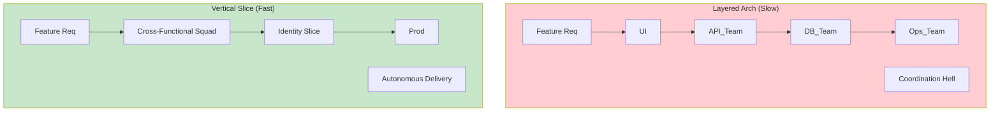
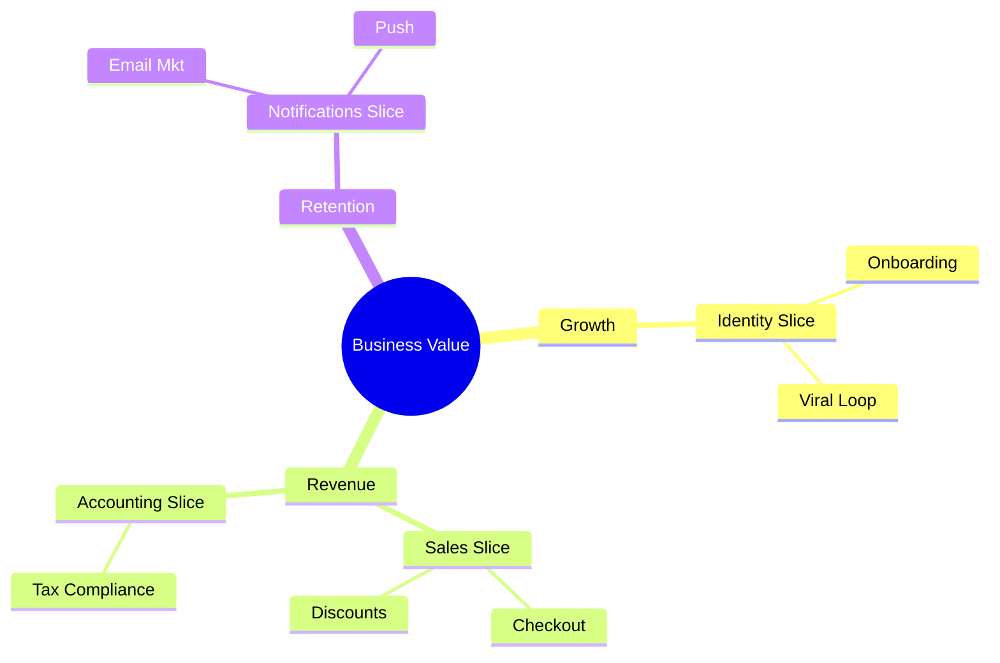

# Post 15: Arquitectura para la Agilidad: ¿Por qué el negocio ama el Vertical Slice? 🏃‍♂️

Como ingenieros, a menudo nos obsesionamos con la "pureza" de las capas. Pero para una empresa, el código es un gasto hasta que llega.

### 🏢 Contexto Real: Velocidad Diferencial
En empresas modernas, no todos los equipos se mueven a la misma velocidad. Un equipo de "Innovación" necesita iterar y romper cosas a diario, mientras que el equipo de "Core" necesita estabilidad absoluta. Una arquitectura monolítica tradicional acopla estos ciclos, haciendo que la innovación ponga en riesgo la estabilidad. Con Vertical Slice Architecture, es posible aislar dominios: el equipo de innovación puede desplegar y fallar en su slice sin afectar la integridad del núcleo del sistema. Agilidad donde se necesita, seguridad donde es obligatoria.

### 🏎️ Velocidad vs. Estabilidad
La verdadera métrica Senior es el **Time-to-Market**.

En `finzapp_api`, el **Vertical Slice Architecture** no es solo una decisión técnica; es una estrategia de agilidad empresarial.

### 🏢 El Problema del "Bloqueo por Capas"
En una arquitectura tradicional, lanzar una nueva función (ej. "Préstamos") requiere que el equipo de DB, el equipo de Backend y el equipo de API se coordinen en capas horizontales. Si una capa se retrasa, todo el negocio se detiene.

### ✨ La Solución: Autonomía de Funcionalidades
Con Vertical Slice, cada dominio es un silo vertical independiente.
- Si el negocio quiere pivotar y cambiar cómo se calculan las comisiones de venta, solo tocamos el slice de `Accounting`.
- No hay efectos secundarios en `Identity` o `Inventory`.
- Un feature puede ir de la idea a producción sin "permiso" de las otras capas.

### 🧠 Mapeo de Negocio a Tecnología
La estructura del código debe reflejar el organigrama y los procesos de la empresa.

### 🚀 Impacto en el Producto
1. **Iteraciones más rápidas**: Lanzamos, medimos y ajustamos en días.
2. **Menos Riesgo**: Un error en un slice nuevo difícilmente tumbará el sistema central.
3. **Escalabilidad del Equipo**: Pueden trabajar 3 equipos en 14 slices diferentes sin pisarse los pies.

### 💡 De Constructor a Estratega
Deja de pensar en "cómo organizar mis carpetas" y empieza a pensar en "cómo mi estructura ayuda al negocio a ganar dinero más rápido". La agilidad técnica es la madre de la agilidad empresarial.

¿Tu arquitectura actual acelera el negocio o lo frena con burocracia de código? 👇

#Agile #BusinessValue #VerticalSlice #SoftwareArchitecture #ProductMindset #Startups
