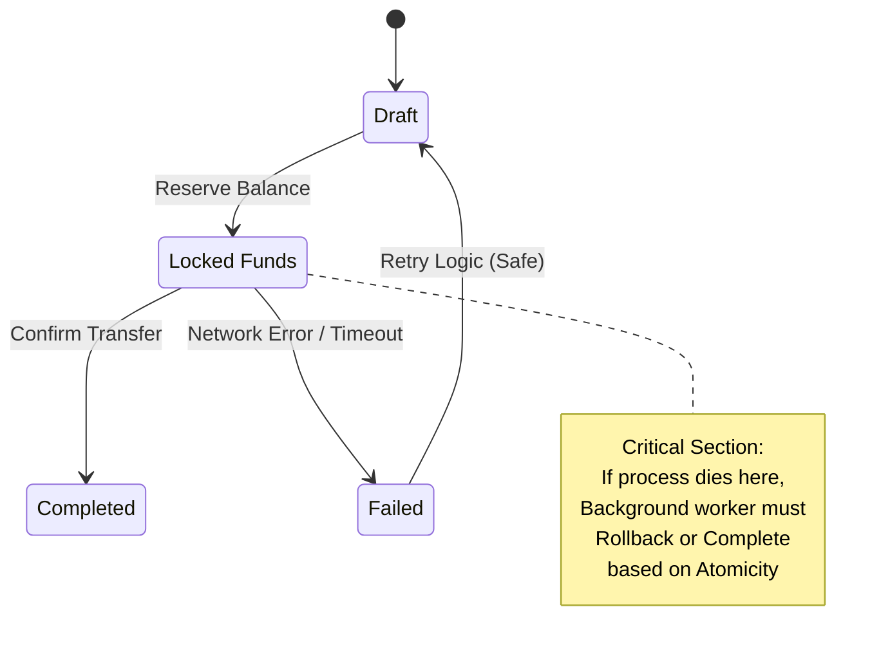
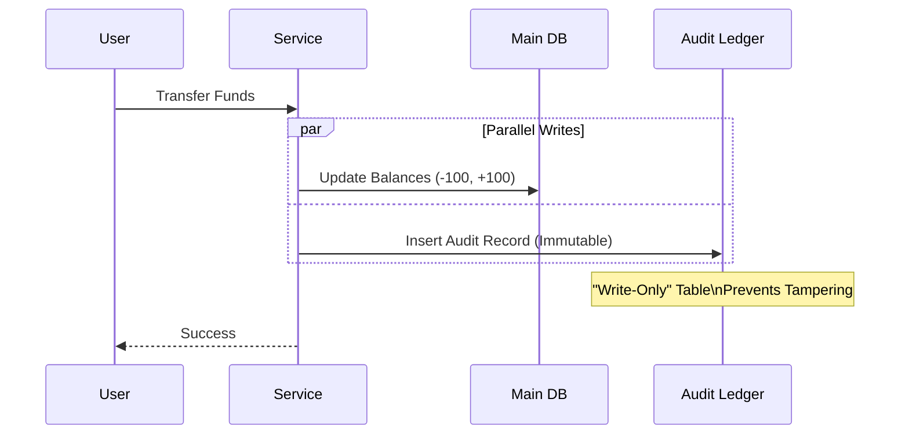

# Post 16: Integridad de Datos: El guardián silencioso de la confianza del cliente 💰
    
Muchos ven el patrón **Unit of Work** como un detalle de implementación para manejar transacciones. Pero desde una perspectiva de producto, es el protector de los activos de la empresa.

### 🏢 Contexto Real: Contabilidad Inmutable
En sistemas contables o wallets digitales, confiar únicamente en el "saldo actual" es peligroso, ya que un error de escritura o una condición de carrera podrían alterar el balance sin dejar rastro. La práctica estándar en Fintech es implementar un "Ledger Inmutable" en paralelo. Cada transacción genera una entrada de "Solo Escritura" (Append-Only) en un registro de auditoría que jamás se modifica. El saldo real se deriva o se valida contra este historial, asegurando matemáticamente que no se pierda ni un centavo y facilitando la conciliación.

### 💰 La Base del Negocio es la Confianza

En `finzapp_api`, no permitimos estados inconsistentes. Si una venta se registra pero el inventario no se actualiza, el negocio pierde dinero y el cliente pierde la confianza.

### 🛡️ El Costo de la Inconsistencia
Imagina que un usuario solicita un retiro de fondos.
1. Se debita de su cuenta.
2. (Error de red)
3. No se registra el movimiento de salida.

El dinero "desaparece" del sistema pero el registro no existe. Esto no es solo un bug; es una crisis de reputación legal y financiera.

### ✨ Unit of Work como Decisión de Negocio
Al usar `Unit of Work`, garantizamos que:
- **Todo ocurre o nada ocurre**: No hay "puntos medios".
- **Auditoría Garantizada**: Si la transacción falla, el historial se mantiene limpio.
- **Confianza del Usuario**: El sistema se siente sólido y confiable, lo cual es vital en aplicaciones financieras.

### 🔍 Auditoría Transaccional
Cada movimiento financiero deja una huella inmutable en paralelo.

### 🚀 Mentalidad de Producto
Un "picador de código" entrega funciones. Un "constructor de productos" entrega **garantías**. Asegurar la integridad de los datos es asegurar la viabilidad del negocio a largo plazo.

¿Cómo proteges los activos de negocio en tu código? ¿Ves las transacciones como algo técnico o como una regla de negocio sagrada? 👇

#DataIntegrity #Fintech #ProductMindset #SoftwareEngineering #UnitOfWork #Trust #BusinessLogic
