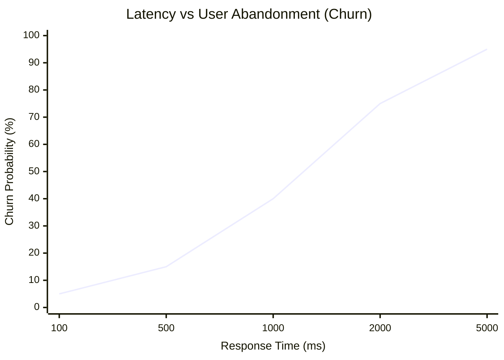

# Post 17: Performance: Por qué Redis es una herramienta de retención de clientes ⚡

Como desarrolladores, amamos la velocidad por el "feeling" técnico. Pero para un negocio de Punto de Venta (POS) como `finzapp`, la velocidad es la diferencia entre que un cliente compre o se vaya frustrado de la tienda.

### 🏢 Contexto Real: Latencia y Conversión
En plataformas de e-commerce o retail de alto volumen, existe una correlación directa y medible entre la latencia de la API y la tasa de abandono del carrito. Estudios demuestran que por cada 100ms de retraso, la conversión puede caer hasta un 1% o más. Optimizar queries pesadas, implementar índices estratégicos y usar caching no son solo mejoras técnicas; son optimizaciones directas de ingresos. En escenarios de checkout, la velocidad de respuesta es una funcionalidad crítica del producto.

### 🏃‍♂️ La velocidad es una Feature

Un API lento aumenta el **Churn Rate** (tasa de abandono). Un API rápido es una ventaja competitiva.

### ⏱️ El Impacto de 500ms
En un entorno de retail, 500ms de retraso por cada producto escaneado puede retrasar un checkout en segundos. Multiplica eso por 100 clientes y tienes una fila eterna. 
El negocio pierde ventas y el cajero pierde la paciencia.

### ✨ Redis como Estrategia de Retención
En `finzapp_api`, el uso de Redis para caching no es un lujo; es una necesidad de producto:
- **Consultas Instantáneas**: Precios y stocks se sirven en milisegundos.
- **Menos Carga en DB**: Evitamos que la base de datos se sature en horas pico, manteniendo el sistema estable cuando más se necesita.
- **Experiencia Premium**: El usuario percibe una app que "vuela", lo que genera confianza y lealtad.

### 📊 Impacto Real de Redis
Comparativa de latencia en endpoints de alto tráfico.

```mermaid
gantt
    title Latency: Database vs Redis
    dateFormat X
    axisFormat %s
    
    section Product Details
    Direct DB Query   : 0, 120ms
    Redis Hit         : 0, 5ms
    
    section User Profile
    Direct DB Query   : 0, 85ms
    Redis Hit         : 0, 3ms
```

### 🚀 Mentalidad de Producto
Deja de ver el performance como un "check" técnico y empieza a verlo como una **métrica de felicidad del usuario**. Cada milisegundo que ahorras es una barrera menos para que el negocio prospere.

¿Mides la latencia de tu API en términos de satisfacción del cliente o solo como una estadística de servidor? 👇

#Performance #UserExperience #Redis #ChurnRate #ProductMindset #BackendOptimization #Scalability
