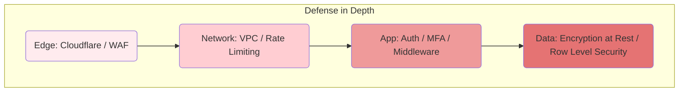
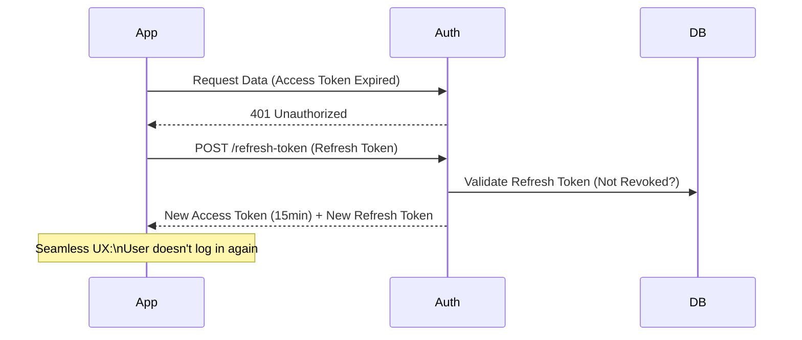

# Post 18: Seguridad: Construyendo el puente de confianza con el usuario final 🛡️

Muchos ven la seguridad (MFA, Rate Limiting, Encriptación) como un "mal necesario" o una lista de tareas de cumplimiento. Pero para un producto que maneja datos financieros como `finzapp`, la seguridad es la base de la **Propuesta de Valor**.

Sin seguridad, no hay confianza. Sin confianza, no hay producto.

### 🧱 Más allá de los "Checks" Técnicos
En `finzapp_api`, cada decisión de seguridad responde a una necesidad de negocio:
- **Rate Limiting**: No es solo para evitar ataques DoS; es para asegurar que el sistema esté siempre disponible para los clientes legítimos.
- **MFA (Multi-Factor Authentication)**: No es un estorbo para el login; es la garantía de que el dinero y los datos del usuario están blindados.
- **Validación Estricta de DTOs**: Protege la integridad de la información que el negocio usa para tomar decisiones.

### ✨ Seguridad como Ventaja Competitiva
Cuando un usuario elige tu app sobre otra, a menudo es porque se siente **seguro** usándola. Implementar buenas prácticas### 🏢 Contexto Real: Seguridad como Habilitador de Ventas
En el mercado B2B Enterprise, la seguridad no es solo un requisito técnico, sino un bloqueador de ventas. Grandes corporaciones exigen cumplimiento estricto (SOC2, encriptación en reposo, rotación de claves) antes de firmar cualquier contrato. Implementar estándares de seguridad robustos desde el día uno (como usar AES-256 para datos sensibles y gestión automatizada de secretos) permite responder afirmativamente a los cuestionarios de seguridad de los clientes, convirtiendo la arquitectura segura en una ventaja competitiva clave.

### 🔒 La seguridad no es un "Add-on"defenderse", es **vender tranquilidad**.

### 🔄 Rotación de Tokens (Seguridad Activa)
Para mitigar el robo de sesiones, los Access Tokens viven poco tiempo.

### 🚀 Construir Productos, no solo Código
Un ingeniero Senior entiende que la seguridad es una inversión en la viabilidad a largo plazo del producto. Si "picas código" ignorando la seguridad, estás construyendo sobre arena. Si construyes producto, cimentas con seguridad.

¿Cómo comunicas el valor de la seguridad a los stakeholders de tu negocio? 👇

#CyberSecurity #Trust #ProductDevelopment #MFA #RateLimit #FinTech #BackendEngineering #ProductMindset
