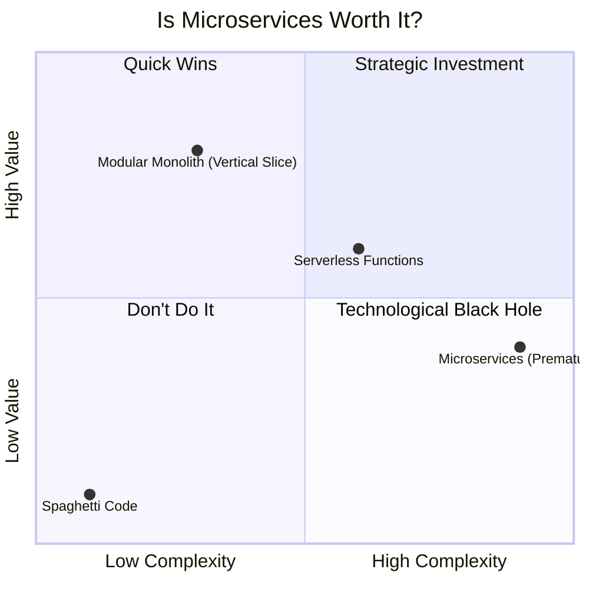
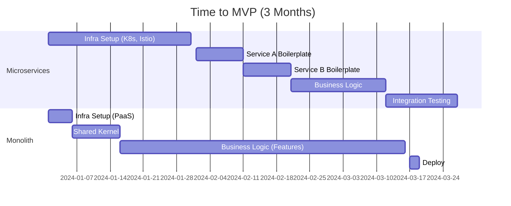

# Post 19: Pragmatismo: Por qué elegir un Monolito Distribuido es una decisión financiera 💰

Si hablas con un reclutador o un CTO, no solo quieren oír que sabes usar la tecnología más compleja. Quieren saber que sabes **gastar inteligentemente su dinero**.

En `finzapp_api`, elegí un **Monolito Distribuido con Vertical Slice** en lugar de microservicios puros. ¿Por qué? Por el **ROI (Retorno de Inversión)**.

### 💸 El Costo Oculto de los Microservicios
Muchos "picadores de código" saltan a los microservicios por moda.
### 🏢 Contexto Real: ROI en Ingeniería
En la toma de decisiones de arquitectura, a menudo surge la tentación de reescribir sistemas completos usando tecnologías de moda (ej. "Pasar todo a Go/Rust") prometiendo escalabilidad teórica. Sin embargo, un enfoque pragmático evalúa el Costo de Oportunidad. Si reescribir toma 3 meses, son 3 meses sin entregar valor al negocio. A menudo, optimizar el stack actual (ej. agregar workers asíncronos a un monolito Python) resuelve el problema de escala con un 10% del esfuerzo, liberando al equipo para construir nuevas funcionalidades que generen ingresos.

### 🧠 Ingeniería es Economía
Un Ingeniero Senior ve los costos:
- Mayor complejidad de red.
- Necesidad de orquestación (Kubernetes).
- Latencia distribuida.
- Dificultad para mantener la consistencia de datos.

Para la etapa actual del negocio, esa inversión no se justifica.

### ✨ El Enfoque Senior: Escalabilidad Lógica
Al usar Vertical Slice, tenemos lo mejor de ambos mundos:
- **Simplicidad de Despliegue**: Un solo pipeline, un solo servidor (ahorro de costos operativos).
- **Aislamiento por Diseño**: Si mañana un módulo necesita escalar de forma independiente, extraerlo a un microservicio es trivial. Ya está aislado lógicamente.

### 📅 Tiempo para el MVP: Monolito vs Microservicios
La realidad de configurar infraestructura distribuida vs escribir lógica de negocio.

### 🚀 De Creador a Estratega
Ser Senior significa entender que el **tiempo de desarrollo** y la **complejidad operativa** son deudas que el negocio debe pagar. Elegir la arquitectura más sencilla que resuelva el problema actual (sin cerrar puertas al futuro) es la marca de un verdadero constructor de productos.

¿Tus decisiones técnicas están basadas en el valor para el negocio o en lo que se ve bien en tu CV? 👇

#SoftwareArchitecture #Pragmatism #ROI #Startups #Backend #VerticalSlice #Microservices #SeniorEngineer
