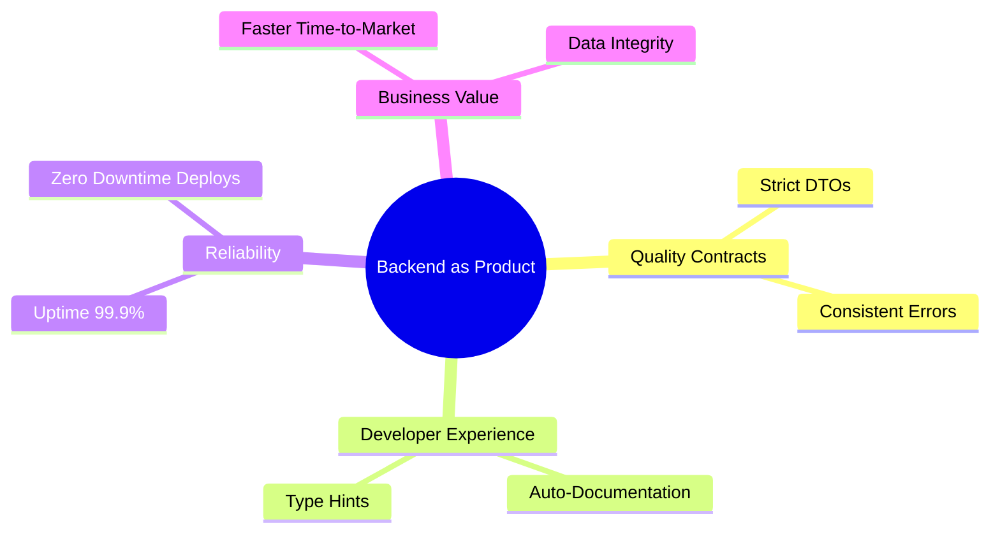
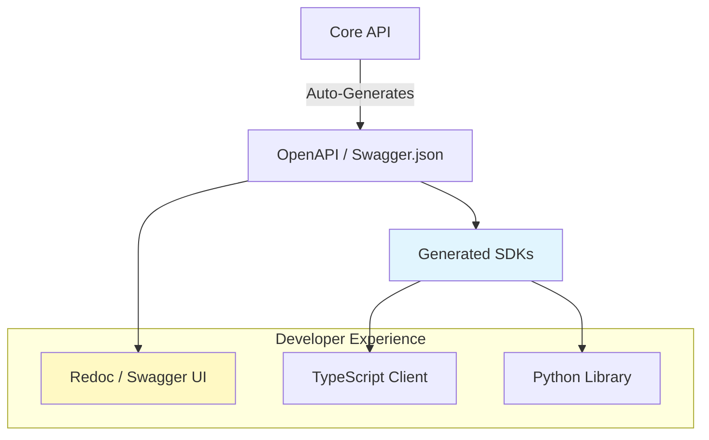

# Post 20: El Backend como Producto: Dejando de picar código 🎨

A menudo los desarrolladores tratamos el backend como algo "oscuro" que solo importa si se rompe. Pero un ingeniero que construye productos (no solo código) trata su API como un producto en sí mismo.

### 🏢 Contexto Real: Backend como Plataforma
En organizaciones donde el backend sirve a múltiples clientes (Mobile, Web, Partners), la falta de documentación y contratos claros convierte al equipo de Backend en un cuello de botella. Tratar la API interna como un "Producto Público" —con documentación (Swagger/OpenAPI) impecable, mensajes de error estandarizados y SDKs generados automáticamente— empodera a los consumidores de la API para integrar nuevas funcionalidades de manera autónoma, reduciendo la dependencia y acelerando el ciclo de entrega de toda la organización.

### 📦 Tu API es tu Producto en sí mismo.

En `finzapp_api`, no solo entregamos funcionalidad; entregamos un **Contrato de Calidad**.

### 🧱 Los Atributos de un Backend "Producto"
1. **Contratos Inquebrantables**: El uso estricto de DTOs y Mappings asegura que el frontend nunca reciba una "sorpresa" inesperada.
2. **Auto-Documentación**: Si tu código no se describe a sí mismo (con tipos, nombres claros y estructuras lógicas), estás fallando como constructor de productos.
3. **Consistencia en el Error**: No devolvemos errores, devolvemos **información**. Un error consistente ayuda al frontend a manejar casos de borde de forma elegante.
4. **Seguridad Invisible**: La seguridad no debe ser un estorbo, sino una capa invisible que da paz mental a todos los stakeholders.

### 🛠️ Ecosistema para Desarrolladores
Tu API no termina en el JSON; termina en la documentación y herramientas que ofreces.

### 🚀 El Salto Mental
El "picador de código" quiere que su código funcione. El "constructor de productos" quiere que su código sea **fácil de consumir, imposible de romper y valioso para el negocio**.

Cuando tratas tu backend como un producto, elevas el estándar de todo tu equipo. Los mejores ingenieros no son los que escriben el código más complejo, sino los que resuelven los problemas más grandes de la forma más elegante y usable.

¿Ves tu código como una lista de tareas completadas o como un producto que facilitas a los demás? 👇

#ProductMindset #SoftwareEngineering #BackendDevelopment #API #Leadership #CleanCode #LeadEngineer
