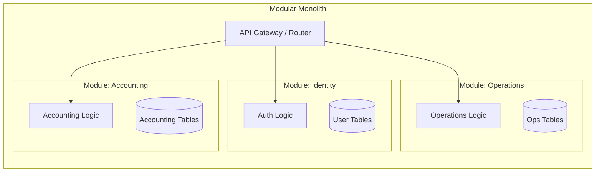

# ADR-001: Adoption of Modular Distributed Monolith

## Status
Accepted

## Context
In developing `finzapp_api`, we faced the critical decision of defining the deployment architecture and code organization. Common options included:
1.  **Traditional Monolith (Layered):** Simple to deploy but tends to become a "Big Ball of Mud" with high coupling.
2.  **Microservices:** Offers high scalability and team autonomy but introduces significant operational complexity (networking, latency, eventual consistency, orchestration) that can stall a small to medium-sized team in early stages.

The goal is to achieve the iteration speed of a monolith and the modularity of microservices without the infrastructure overhead of the latter.

## Decision
We have decided to adopt a **Modular Distributed Monolith** architecture.

This architecture implies:
*   **Single Deployment Unit:** The application is deployed as a single artifact (e.g., a Docker container), simplifying infrastructure and reducing costs.
*   **Strict Logical Boundaries:** Internally, code is organized into business modules (Slices) that do not share data models or internal logic directly but communicate through public interfaces or events.
*   **Extraction-Ready:** Modules are designed to be extracted into independent microservices with minimal effort if scaling requires it in the future.

## Detailed Design

### Module Structure
Instead of organizing by technical layers (Controllers, Services, DAOs), we organize by business domains.

### Inter-Module Communication
To prevent coupling, modules cannot import internal classes from other modules.
*   **Synchronous:** Through public interfaces (Facades) defined in a `Shared Kernel` or explicitly exposed by the module.
*   **Asynchronous:** Preferably via an in-memory Event Bus (for in-process tasks) or external broker (for background tasks), decoupling execution.

## Consequences

### Positive
*   **Operational Simplicity:** No complex orchestration (Kubernetes) is required to start. CI/CD is straightforward.
*   **Safe Refactoring:** IDEs can refactor code across modules easily, which is difficult in distributed microservices.
*   **Performance:** Calls between modules are in-memory function calls, eliminating network latency.
*   **Evolvability:** Facilitates the transition to microservices only for modules that truly need it (e.g., due to specific CPU load).

### Negative
*   **Global Horizontal Scaling:** The entire application scales, not just a specific module. If the "Reporting" module consumes a lot of RAM, the whole monolith must be replicated.
*   **Coupling Risk:** Requires strict team discipline not to violate module boundaries (tools like `archunit` or linters can be used to enforce this).

## Compliance
*   Code reviews must reject cross-module imports that do not go through the module's public API.
*   Each module must own its database tables (or logical schema), avoiding `JOINs` between tables of different modules.
