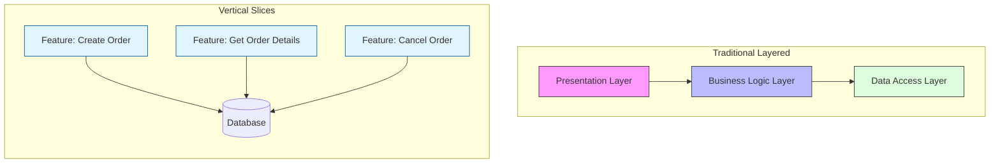

# ADR-002: Vertical Slice Architecture

## Status
Accepted

## Context
Traditional layered architectures (Onion, Hexagonal, Clean) often lead to "lasagna code": adding a simple feature requires modifying multiple files across horizontal layers (Controller, Service, Repository, DTO, Mapper). This increases cognitive load, hinders cohesion, and often results in unnecessary abstractions that add no business value.

The main problem is horizontal coupling: changes in the data layer often ripple through all upper layers.

## Decision
Adopt **Vertical Slice Architecture** (VSA). Instead of grouping code by technical type (Layers), it is grouped by business functionality (Features).

## Detailed Design
Each "slice" is a self-contained functionality encapsulating everything needed to fulfill its purpose: from API exposure to data access.

### Directory Structure
```
src/
  features/
    identity/
      register_user/
        handler.py       # Controller / Logic
        command.py       # Input DTO
        repository.py    # Specific Data Access
      login_user/
        ...
    sales/
      create_order/
        ...
```

### Flow Diagram



Each slice can decide its own internal complexity. A simple read slice might query the database directly (CQRS), while a complex write slice might use a rich Domain Model.

## Consequences

### Positive
*   **High Cohesion:** All code related to a feature is located together. Changing a feature involves touching only one folder.
*   **Low Coupling:** Slices do not depend on each other. Deleting a feature is as simple as deleting its folder.
*   **Flexibility:** Allows using different patterns or libraries in different slices as needed (e.g., using an ORM in some and raw SQL in others).

### Negative
*   **Code Duplication:** Some duplication of infrastructure logic or utilities may occur between slices (mitigated by a `Shared Kernel`).
*   **Learning Curve:** Requires a mindset shift for developers accustomed to thinking in "Layers".

## Compliance
*   Avoid creating "Entity Services" (e.g., `UserService` with 50 methods). Instead, create `RegisterUserHandler`, `UpdateUserProfileHandler`, etc.
*   Shared code must reside strictly in `src/shared` or `src/core`.
