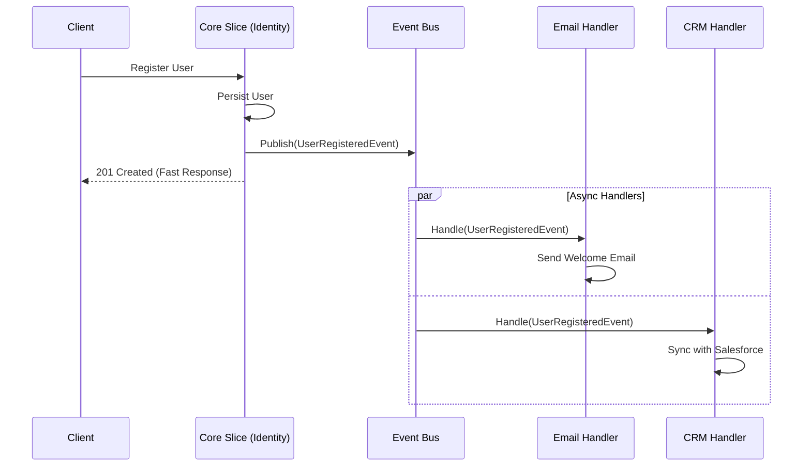

# ADR-003: Module Decoupling via Observer Pattern (Event Bus)

## Status
Accepted

## Context
In critical business flows like user registration or order creation, multiple side effects are often required: sending welcome emails, notifying external systems (CRM), updating statistics, or assigning initial resources.

If these actions are implemented sequentially and synchronously within the main service (e.g., `RegisterUserHandler`), several problems arise:
1.  **High Coupling:** The registration service depends directly on email, CRM services, etc.
2.  **SRP Violation:** The service "knows" too much.
3.  **Low Resilience:** If the email service fails, the entire registration transaction fails, affecting the user experience.
4.  **Latency:** The sum of external service response times slows down the response to the user.

## Decision
Implement the **Observer Pattern** via an **Event Bus** to handle side effects.

The main flow (Core Domain Logic) is only responsible for completing the primary transaction and publishing a **Domain Event** (e.g., `UserRegisteredEvent`). Subscribers (Observers/Handlers) react to this event asynchronously or in a decoupled manner.

## Detailed Design

### Event Flow

### Technical Implementation
*   **Events:** Immutable objects (DTOs/Data Classes) representing something that *has already happened* (`UserRegistered`, `OrderPlaced`).
*   **Bus:** A mediator that dispatches events to registered subscribers. It can be in-memory (for initial simplicity) or persistent (RabbitMQ/Kafka) for greater robustness.

## Consequences

### Positive
*   **Total Decoupling:** The event producer does not know the consumers. New reactions (e.g., "Send SMS") can be added without touching the registration code.
*   **Performance:** The user receives an immediate response. Heavy processes occur in the background.
*   **Separation of Concerns:** Each handler takes care of a single task.

### Negative
*   **Eventual Consistency:** The system is no longer globally atomic. The user might be registered but not yet have their welcome email.
*   **Debugging Complexity:** Execution flow is non-linear, making error tracing difficult without good distributed logging/tracing.

## Compliance
*   Events must be named in the past tense.
*   Handlers must be idempotent whenever possible.
*   A "Dead Letter Queue" or retry mechanism must be implemented to handle failures in subscribers.
