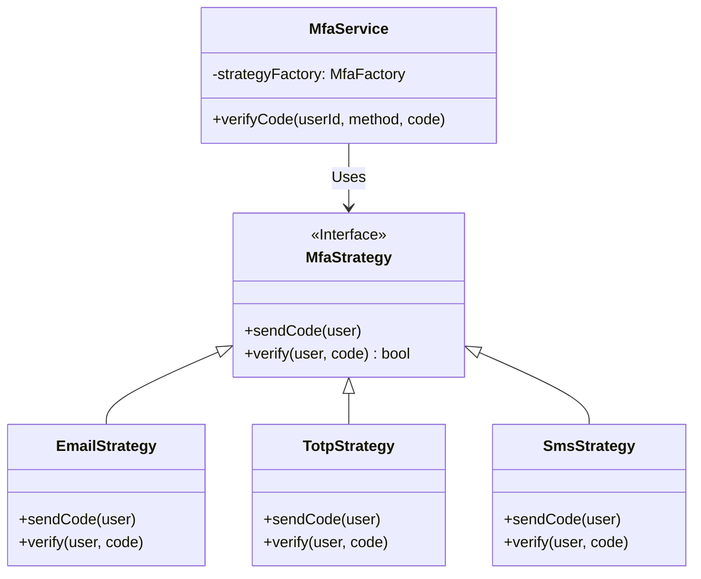

# ADR-004: Implementing Multiple Authentication Strategies with Strategy Pattern

## Status
Accepted

## Context
The `finzapp_api` application must support multiple two-factor authentication (MFA) methods for different user types (Email, SMS, TOTP, Biometrics). Implementing these methods often leads to complex conditional structures (`if/else` or `switch`) that are difficult to maintain and scale.

The requirement to add new methods without modifying existing code is crucial to comply with the Open/Closed Principle (OCP).

## Decision
Use the **Strategy Pattern** to encapsulate each authentication algorithm into a separate, interchangeable class.

## Detailed Design

### Class Diagram

### Execution Flow
1.  The `MfaService` receives a verification request (`method="sms"`).
2.  It queries a `Factory` or strategy registry to get the instance corresponding to "sms".
3.  It invokes the `.verify()` method of the retrieved strategy.
4.  The strategy encapsulates all specific logic (Twilio call, TOTP hash validation, etc.).

## Consequences

### Positive
*   **Extensibility (OCP):** Adding support for "FaceID" only requires creating `BiometricStrategy` and registering it. `MfaService` is untouched.
*   **Testability:** Each strategy can be unit-tested in isolation with its own mocks.
*   **Code Cleanliness:** Giant conditional blocks are eliminated.

### Negative
*   **Structural Complexity:** Increases the number of classes and files in the project.
*   **Instantiation Overhead:** If not managed well (e.g., Singleton), constant creation of strategies can have a slight memory impact.

## Compliance
*   All strategies must implement the same `MfaStrategy` interface.
*   The strategy selection logic must reside in a `Factory` or dependency injection container, not in the business service.
