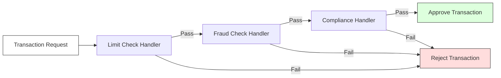

# ADR-005: Handling Complex Sequential Validations via Chain of Responsibility

## Status
Accepted

## Context
In `finzapp_api`, transaction approval processes (credits, payments) require a series of sequential validations that must be met in a specific order (e.g., check stock -> validate balance -> check daily limits -> fraud analysis).

Implementing these rules in a single method (`processTransaction`) results in a "God Class" with hundreds of lines and high cyclomatic complexity. Additionally, the need to alter the order or dynamically disable rules (e.g., for VIP clients) is nearly impossible with rigid imperative code.

## Decision
Implement the **Chain of Responsibility Pattern**.

Each validation rule is encapsulated in an independent "Handler" class. These handlers are linked to form a chain. The request travels through the chain until it is rejected or approved by all links.

## Detailed Design

### Chain Structure



### Technical Implementation
An abstract base class `ValidationHandler` is defined with a `set_next(handler)` method and an abstract `handle(request)` method.

```python
class ValidationHandler(ABC):
    def set_next(self, handler):
        self._next_handler = handler
        return handler

    def handle(self, request):
        if self._next_handler:
            return self._next_handler.handle(request)
        return True
```

## Consequences

### Positive
*   **Single Responsibility Principle:** Each class validates only one thing.
*   **Dynamic Flexibility:** Different chains can be built at runtime (e.g., `VIPChain` vs `StandardChain`).
*   **Reusability:** Handlers (e.g., `FraudCheck`) can be reused in other flows.

### Negative
*   **Accumulated Latency:** If the chain is very long, there might be a performance impact (though negligible in memory).
*   **Tracing Difficulty:** It can be hard to know which exact handler rejected the request without a good structured logging/error system.

## Compliance
*   Handlers should not mutate the request state, only validate it (although in some cases they may enrich it).
*   If a handler rejects, it must return an exception or a specific error result identifying the cause.
