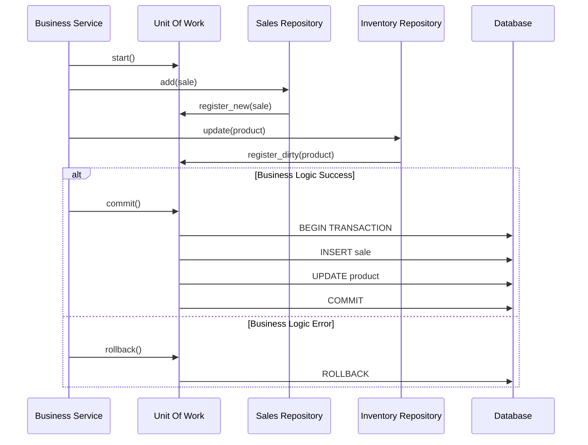

# ADR-006: Transactional Consistency Assurance via Unit of Work

## Status
Accepted

## Context
In complex business use cases (e.g., "Process Purchase"), multiple aggregates or database tables need to be modified (Inventory, Sales, Accounting).

If transactions are managed manually or scattered across repositories, there is a high risk of **data inconsistency** due to partial failures (e.g., stock is deducted, but the sale record fails). Furthermore, passing the database connection/session object between services couples business logic to persistence infrastructure.

## Decision
Implement the **Unit of Work (UoW) Pattern** to manage business transaction atomicity.

The UoW maintains a list of objects affected by a business transaction and coordinates the writing out of changes and the resolution of concurrency problems.

## Detailed Design

### Transaction Flow



### Technical Implementation
In Python, this is preferably implemented via **Context Managers** (`async with`):

```python
async with unit_of_work:
    await unit_of_work.sales.add(sale)
    await unit_of_work.inventory.decrease_stock(product_id, qty)
    # Automatic commit on exit if no exceptions
```

The UoW is the only point where the database session is injected, keeping repositories and services free from explicit transaction management.

## Consequences

### Positive
*   **Guaranteed Atomicity:** Either all operations succeed, or none are applied.
*   **Persistence Abstraction:** Decouples business logic from `commit/rollback` details.
*   **Testability:** Facilitates mocking the entire transaction layer.

### Negative
*   **Implementation Complexity:** Requires creating an abstraction layer over the ORM or database driver.
*   **Locking:** Long transactions can lock database resources. The duration of the `with` block must be minimized.

## Compliance
*   Never call `commit()` inside an individual repository.
*   All write operations must be wrapped in a `UnitOfWork` block.
