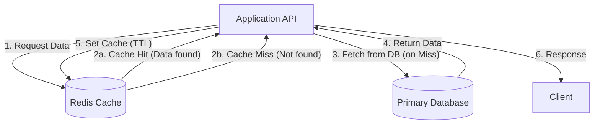

# ADR-007: Caching Strategy with Redis (Cache-Aside)

## Status
Accepted

## Context
In `finzapp_api`, repetitive read queries (e.g., Product Catalog, User Profile) place a significant load on the primary relational database (PostgreSQL). This increases latency and limits the horizontal scalability of the system.

Without a caching strategy, every read request hits the disk, which is inefficient and costly.

## Decision
Implement a **Cache-Aside** strategy using **Redis** as an in-memory key-value store.

## Detailed Design

### Cache-Aside Pattern

### Serialization and Keys
*   **Format:** JSON (for readability and compatibility) or MsgPack (for efficiency).
*   **Keys:** `v1:user:{id}:profile`, `v1:product:{id}:details`.
*   **TTL (Time To Live):** Each entry must have a default expiration time to prevent indefinitely stale data.

### Invalidation
To ensure consistency, when a write occurs (Update/Delete):
1.  The database is updated.
2.  The corresponding entry in Redis is invalidated (deleted) immediately.
3.  The next read will repopulate the cache with fresh data.

## Consequences

### Positive
*   **Performance:** Drastic reduction in latency (< 5ms for cache reads).
*   **Scalability:** Reduces load (CPU/IO) on the primary database, allowing it to focus on writes.
*   **Cost:** Redis is cheaper to scale for simple reads than a relational database.

### Negative
*   **Operational Complexity:** Requires managing a new infrastructure component (Redis).
*   **Eventual Consistency:** There is a small time window where the cache might hold stale data, especially in distributed systems.

## Compliance
*   Critical transaction data (e.g., bank balance before a transfer) must **NOT** be read from the cache, but directly from the database with locking.
*   Always use TTL.
