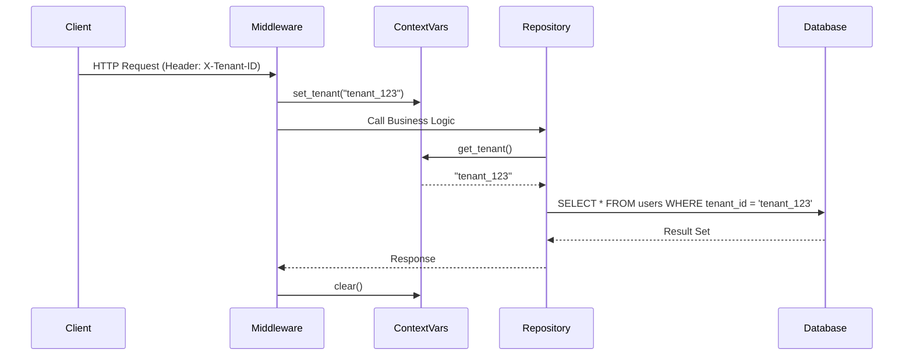

# ADR-009: Data Isolation in Multi-Tenant Environment (SaaS)

## Status
Accepted

## Context
`finzapp_api` operates as a SaaS (Software as a Service) platform where multiple clients (companies) share the same infrastructure and database.
The risk of **Cross-Tenant Data Leakage** is critical. If a query forgets to filter by `tenant_id`, a client could see a competitor's data.

Relying on every developer to remember to add `WHERE tenant_id = ?` to every SQL query is a fragile strategy prone to human error.

## Decision
Implement **Logical Isolation via Context Middleware and Row Level Security (RLS)** (or ORM global filters).

The `tenant_id` is extracted once at the transport layer (HTTP) and injected into a global context (`ContextVar`). The persistence layer applies the filter automatically without programmer intervention.

## Detailed Design

### Context Flow

### Technical Implementation
*   **Identification:** The tenant is identified by `Subdomain`, `Header`, or a claim in the `JWT`.
*   **Propagation:** Python's `contextvars` are used to propagate the ID across async calls.
*   **Filtering:**
    *   *Option A (ORM):* Global Query Filter (e.g., SQLAlchemy `before_cursor_execute`).
    *   *Option B (DB):* PostgreSQL Row Level Security (RLS) policies.

## Consequences

### Positive
*   **Security by Design:** It is impossible to forget the filter, as it is integrated into the infrastructure.
*   **Code Simplicity:** Developers write `select * from users` and the system handles the rest.
*   **Scalability:** Allows hosting thousands of tenants on a single DB instance.

### Negative
*   **Debugging Complexity:** The actual executed queries are different from those written in the code.
*   **Data Migration:** Moving a tenant to another database or sharding is more complex than with separate databases.

## Compliance
*   All business tables must have an indexed `tenant_id` column.
*   The middleware must reject any request without a valid tenant context (401/403).
