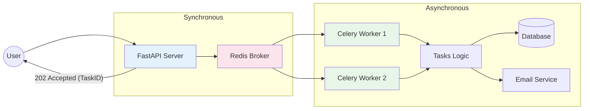

# ADR-010: Asynchronous Processing of Heavy Tasks (Celery + Redis)

## Status
Accepted

## Context
Certain business operations, such as generating financial PDF reports, sending mass emails, or importing large CSV files, are CPU and I/O intensive.
Executing these tasks synchronously within the HTTP Request-Response lifecycle blocks the execution thread, causing timeouts, poor user experience, and potential server crashes due to resource exhaustion.

## Decision
Implement an **Asynchronous Task Queue** system using **Celery** as the framework and **Redis** as the message broker.

## Detailed Design

### Producer-Consumer Architecture

### Execution Flow
1.  **API:** Receives the request, validates data, and enqueues a message in Redis (`task.apply_async()`).
2.  **API:** Immediately returns an HTTP `202 Accepted` with a `task_id`.
3.  **Worker:** A separate process (Celery) picks up the message from the queue and executes the heavy function.
4.  **Result:** The worker updates the task status (SUCCESS/FAILURE) in a Result Backend (Redis/DB).

## Consequences

### Positive
*   **Resilience:** If the worker fails, the task is automatically retried (configurable with `retry_backoff`).
*   **Scalability:** More workers can be added on different servers to process more tasks in parallel without touching the API.
*   **UX:** The user perceives an instant response.

### Negative
*   **Infrastructure Complexity:** Requires maintaining additional instances (Workers, Redis, Flower for monitoring).
*   **Debugging Difficulty:** Errors happen "elsewhere" and not in the HTTP request stack trace.

## Compliance
*   No task taking longer than 500ms should execute on the main API thread.
*   Tasks must be idempotent whenever possible.
