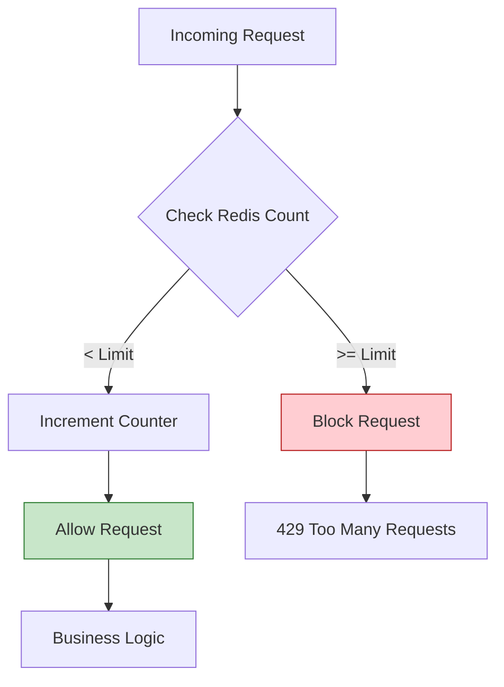

# ADR-011: Infrastructure Protection via Dynamic Rate Limiting

## Status
Accepted

## Context
Public API endpoints are vulnerable to various types of abuse:
1.  **Brute Force / Credential Stuffing Attacks:** Bots testing thousands of user/password combinations.
2.  **Application Layer Denial of Service (DDoS):** Resource exhaustion (DB connections, CPU) due to excessive requests.
3.  **Client Errors:** Infinite loops in third-party integrations that accidentally saturate the API.

Without a control mechanism, a single malicious or faulty actor can degrade service for all users.

## Decision
Implement a **Rate Limiting** system at the middleware level, using **Redis** as a fast state store.

## Detailed Design

### Algorithm: Sliding Window
Unlike a fixed window (which allows bursts at the minute change), the sliding window smooths traffic and is fairer.

### Technical Implementation
*   **Store:** Redis (for its millisecond speed and atomic operations).
*   **Key:** `ratelimit:{ip}:{endpoint}` or `ratelimit:{user_id}:{action}`.
*   **Response:** HTTP `429 Too Many Requests` including informative headers:
    *   `X-RateLimit-Limit`: Total limit.
    *   `X-RateLimit-Remaining`: Remaining requests.
    *   `Retry-After`: Seconds to wait before retrying.

### Atomicity with LUA
To avoid race conditions (check-then-set), the increment and verification logic executes via LUA scripts in Redis or atomic commands.

## Consequences

### Positive
*   **Resource Protection:** Ensures CPU and database are not saturated by abusive traffic.
*   **Availability:** Ensures fair bandwidth for all legitimate users.
*   **Security:** Mitigates brute force attacks on login.

### Negative
*   **False Positives:** If multiple users share an IP (NAT), they might block each other (mitigated by using Rate Limit per authenticated User).
*   **Additional Latency:** Adds a small overhead (Redis round-trip) to each request.

## Compliance
*   All public endpoints (unauthenticated) must have a strict limit per IP.
*   Authenticated endpoints must have limits per `user_id`.
