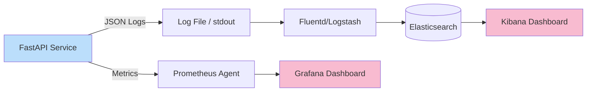

# ADR-013: Full Observability via Structured Logging and Metrics

## Status
Accepted

## Context
In a distributed, high-traffic system like `finzapp_api`, production failures (latency, 500 errors) are inevitable.
However, detecting the root cause in scattered plain text logs across multiple servers is a titanic and slow task.
Lack of awareness of the real system state ("Why is the payment endpoint slow?") affects customer trust and SLA.

## Decision
Implement an **Observability** strategy based on three pillars: Structured Logging (JSON), Metrics (Prometheus), and Distributed Tracing (Correlation IDs).

## Detailed Design

### Observability Pipeline



### Structured Logging (JSON)
Instead of `print("Error in user")`, JSON objects are emitted that analysis tools can index and filter.

```json
{
  "timestamp": "2023-10-27T10:00:00Z",
  "level": "ERROR",
  "correlation_id": "abc-123-xyz",
  "module": "payments",
  "message": "Payment gateway timeout",
  "user_id": 451,
  "stack_trace": "..."
}
```

### Tracing (Correlation ID)
Each incoming HTTP request receives a unique ID (`X-Request-ID`) at the Load Balancer or Middleware. This ID propagates to all logs and internal service calls, allowing the full "story" of a transaction to be reconstructed.

## Consequences

### Positive
*   **MTTR (Mean Time To Repair):** Drastically reduces time to find bugs.
*   **Proactive Alerting:** Alerts can be configured if average latency rises above 200ms, before users complain.
*   **Distributed Debugging:** Ability to trace a request across microservices or workers.

### Negative
*   **Data Volume:** Detailed logging can generate gigabytes of data daily, increasing storage costs (ELK/Datadog).
*   **Overhead:** Log serialization and metric collection consume a small fraction of CPU.

## Compliance
*   Prohibited to use `print()` in production. Always use the configured logger.
*   All error logs must include context (user_id, tenant_id) if available.
