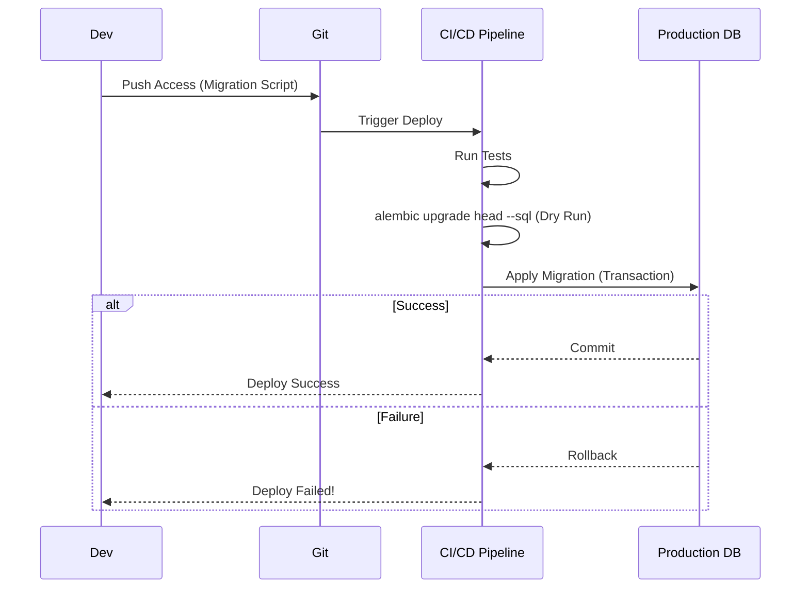

# ADR-014: Safe Database Schema Management (Zero-Downtime Migrations)

## Status
Accepted

## Context
In a high-availability production system, database schema changes (e.g., adding a column, renaming a table) are high-risk operations.
A simple `ALTER TABLE` on a table with millions of records can lock the entire table, halting the service for minutes or hours.
Furthermore, lack of version control on SQL schemas makes it impossible to know the exact state of the database across environments (Dev, Staging, Prod).

## Decision
Use **Alembic** for database version control and adopt the **Expand-Migrate-Contract** pattern for destructive changes.

## Detailed Design

### Alembic Workflow
Every change to the database structure must be a migration script in the repository.

### Expand-Migrate-Contract Pattern
To avoid downtime when modifying data (e.g., renaming column `addr` to `address`):
1.  **Expand:** Add column `address` (nullable). Code writes to both, reads from `addr`.
2.  **Migrate:** Background script copies data from `addr` to `address`.
3.  **Contract:** Code reads from `address`. `addr` is dropped.

This process ensures the application never stops working during deployment.

## Consequences

### Positive
*   **Reproducibility:** A development environment identical to production can be spun up in seconds.
*   **Safety:** Changes are tested in CI before touching production. Automatic rollbacks in case of error.
*   **Zero Downtime:** Users do not notice the database is being updated.

### Negative
*   **Discipline:** Requires more steps than simply running SQL in the console.
*   **Complexity:** Destructive changes require multiple deployments (phases).

## Compliance
*   Prohibited to execute DDL (Data Definition Language) manually in production.
*   Migrations must be peer-reviewed, paying attention to potential table locks.
