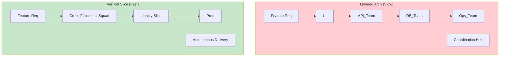

# ADR-015: Architecture Alignment with Business Domains (Agility)

## Status
Accepted

## Context
In growing organizations, different business areas (e.g., Marketing, Operations, Risk) evolve at disparate paces.
A traditional "layered" monolithic architecture (UI, Logic, Data) couples these areas horizontally. A change in "Risk" logic might require coordination and joint deployment with the "Marketing" team, slowing innovation and increasing regression risk.

The goal is to reduce **Time-to-Market** and allow teams to work autonomously.

## Decision
Adopt an architecture based on **Business Domains** (Domain-Driven Design / Vertical Slices) that reflects the company's structure and value streams (Conway's Law).

## Detailed Design

### Lifecycle Decoupling
Each "Slice" or business module is an independent unit that can be developed, tested, and deployed (logically) by a cross-functional team (Squad).

### Value Mapping
Folder and module structure must answer business questions, not technical ones.
*   `src/features/loans` (not `src/services/LoanService.java`)
*   `src/features/onboarding`

## Consequences

### Positive
*   **Autonomy:** A team can iterate on its domain without asking for permission from others.
*   **Resilience:** A failure in the "Notifications" module does not crash the "Core Banking" system.
*   **Cognitive Load:** Developers only need to understand the domain they work in, not the entire system.

### Negative
*   **Duplication:** There may be repeated code between domains (accepted as the cost of independence).
*   **Governance:** A Platform or Architecture team is required to maintain cross-cutting standards (logging, auth).

## Compliance
*   Module boundaries must be defined together with domain experts (Product Owners), not just by developers.
*   Avoid sharing database models between domains.
