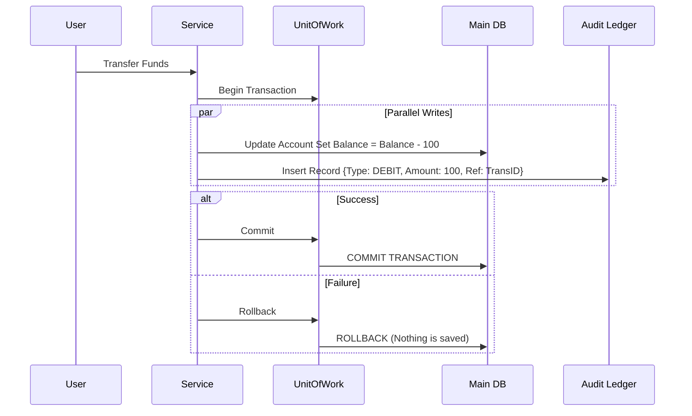

# ADR-016: Financial Data Integrity and Immutable Audit

## Status
Accepted

## Context
In financial or accounting systems, relying solely on the current state of an entity (e.g., `balance = 100`) is insufficient and dangerous.
Concurrency errors, network failures, or logic bugs can alter the balance without a trace, making reconciliation impossible and destroying user trust.
Data loss or inconsistency (e.g., money deducted but not transferred) has serious legal implications.

## Decision
Implement an **Immutable Audit Ledger (Append-Only)** in parallel to state tables, atomically managed via the **Unit of Work** pattern.

## Detailed Design

### Atomic Double Write
Every operation that modifies financial state must simultaneously insert a record into an audit table (Ledger).

### Ledger Characteristics
*   **Write-Only (Append-Only):** `UPDATE` or `DELETE` operations are not allowed.
*   **Immutability:** Guaranteed by database permissions or WORM (Write Once Read Many) technology if required by regulation.
*   **Reconciliation:** Current balance must always be recalculable by summing the entire Ledger history.

## Consequences

### Positive
*   **Total Traceability:** Every penny has an explainable history.
*   **Disaster Recovery:** If the balance table is corrupted, it can be rebuilt from the Ledger.
*   **Regulatory Compliance:** Satisfies financial audit requirements.

### Negative
*   **Data Volume:** The Ledger table grows indefinitely. Requires partitioning or archiving strategies (Cold Storage) in the long term.
*   **Performance:** Double writing implies a slight overhead on each transaction.

## Compliance
*   Prohibited to modify balances without creating the corresponding entry in the Ledger.
*   Unit tests must verify that the Ledger matches the final balance.
