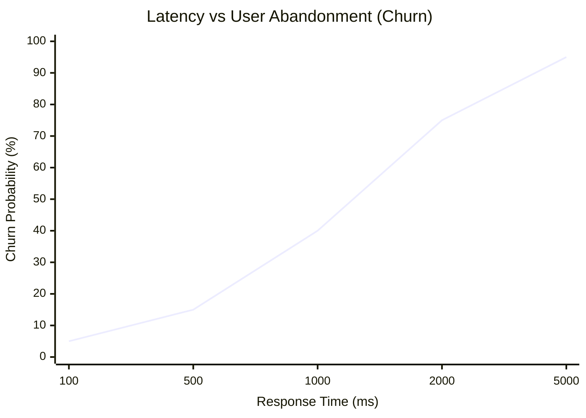

# ADR-017: Latency as Product KPI and User Retention (Redis)

## Status
Accepted

## Context
In e-commerce and Point of Sale (POS) platforms like `finzapp_api`, response speed is directly proportional to conversion and retention rates.
Studies show that latency greater than 500ms at checkout can significantly reduce sales.
The relational database (PostgreSQL) becomes a bottleneck under high concurrency, degrading User Experience (UX).

## Decision
Prioritize **Low Latency (<100ms)** as a critical functional requirement, implementing **Aggressive Caching with Redis** on critical paths (Catalog, Profile, Checkout).

## Detailed Design

### Optimization Strategy
It's not just about "caching everything," but optimizing user flows that generate revenue.

```mermaid
gantt
    title Latency Comparison: Database vs Redis
    dateFormat X
    axisFormat %s

    section Product Details
    Direct DB Query   : 0, 120ms
    Redis Hit         : 0, 5ms

    section User Profile
    Direct DB Query   : 0, 85ms
    Redis Hit         : 0, 3ms
```

### Business Metrics
The correlation between Latency and Churn will be monitored.

## Consequences

### Positive
*   **Conversion:** Direct increase in sales and customer satisfaction.
*   **Scalability:** Redis handles thousands of RPS with minimal CPU, protecting the main DB.
*   **Resilience:** The system can continue serving reads (from cache) even if the DB is under extreme load.

### Negative
*   **Invalidation Complexity:** Keeping the cache synchronized requires a robust strategy (see ADR-007).
*   **Memory Costs:** Storing the entire catalog in RAM can be expensive if expiration is not managed well (LRU).

## Compliance
*   Any critical endpoint taking longer than 200ms in 95% of cases (p95) must be optimized or cached mandatorily.
*   Latency metrics must be included in business dashboards.
