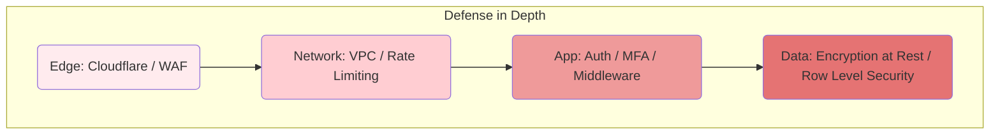
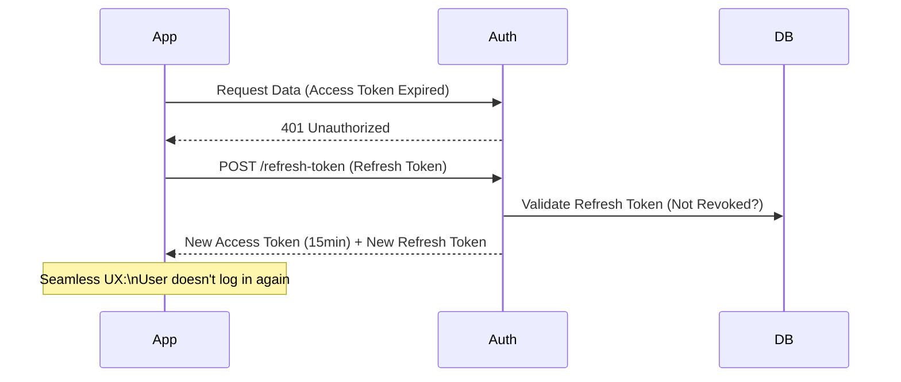

# ADR-018: Defense in Depth Security for Customer Trust

## Status
Accepted

## Context
In the B2B Enterprise and Fintech market, security is not an optional feature but a contractual and compliance requirement (SOC2, GDPR, PCI-DSS).
Relying on a single layer of defense (e.g., just authentication) is insufficient.
Corporate clients demand guarantees that their data is encrypted, isolated, and protected against advanced attacks.

## Decision
Implement a **Defense in Depth** strategy, applying multiple security controls at each layer of the technology stack.

## Detailed Design

### Security Layers

### Session Management (Refresh Tokens)
To minimize credential theft risk, Access Tokens are short-lived (15 min) and rotated via secure Refresh Tokens (HttpOnly Cookie).

## Consequences

### Positive
*   **B2B Sales:** Enables closing contracts with large companies that audit security.
*   **Trust:** End users trust the platform with their financial data.
*   **Resilience:** If one layer fails (e.g., WAF bypass), other layers protect the core (e.g., RLS in DB).

### Negative
*   **Development Friction:** Requires configuring and maintaining multiple tools (WAF, Vault, IAM).
*   **UX Complexity:** MFA and short sessions can annoy non-technical users if not designed well.

## Compliance
*   All secrets (API Keys, DB Passwords) must be managed in a Secret Manager, never in code.
*   Sensitive data (PII) must be encrypted at rest (AES-256) and in transit (TLS 1.3).
