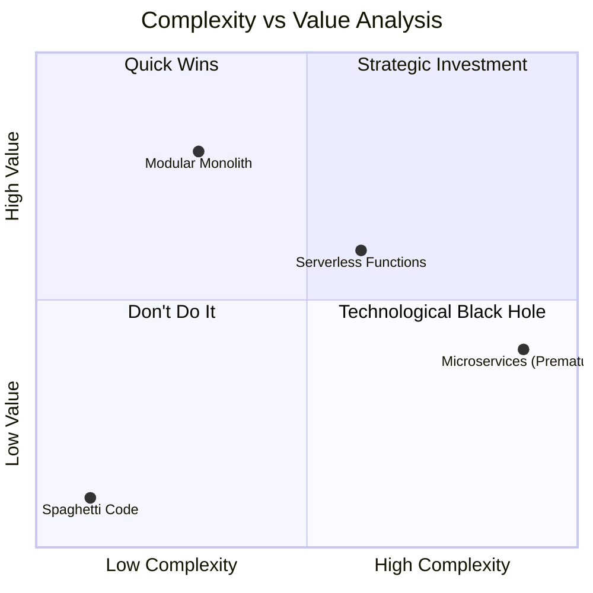
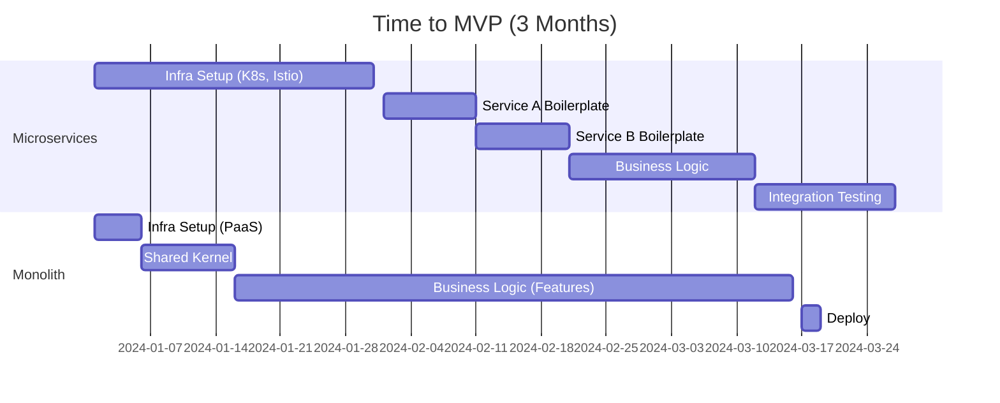

# ADR-019: Pragmatic Architecture Based on Return on Investment (ROI)

## Status
Accepted

## Context
In the current tech ecosystem, there is strong pressure to adopt complex architectures (Microservices, Kubernetes, Serverless) prematurely.
However, for a startup or growing product, the scarcest resource is engineering time.
Investing months in distributed infrastructure before validating the business model is a high financial risk (Opportunity Cost).

## Decision
Prioritize a **Modular Monolith (Vertical Slice)** approach over Distributed Microservices for the current business stage.

The decision is based on maximizing ROI: obtaining the most business functionality with the least accidental complexity possible.

## Cost-Benefit Analysis

### Time to Market (MVP)

## Consequences

### Positive
*   **Speed:** The team focuses on solving user problems, not configuring mesh networks.
*   **Operational Costs:** A single instance (or small cluster) is cheaper than orchestrating dozens of containers.
*   **Simplicity:** Debugging and testing are trivial in a single process.

### Negative
*   **Team Scaling:** Beyond a certain size (e.g., 50 engineers), the monolith can cause merge conflicts (mitigated by strict modules).
*   **Homogeneous Technology:** The entire system must use the same main language/framework.

## Compliance
*   Any proposal to introduce a new independent service must come with an ROI analysis justifying why it cannot live inside the modular monolith.
