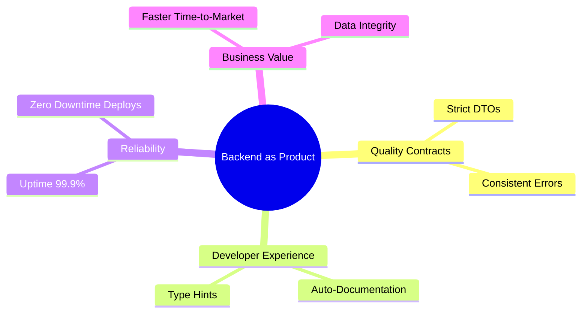
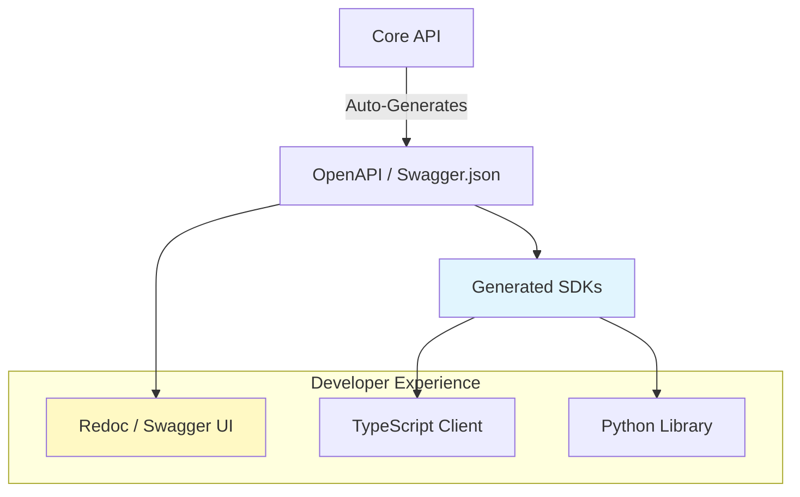

# ADR-020: Backend as an Internal Product

## Status
Accepted

## Context
In modern organizations, the API is consumed by multiple "clients" (Mobile App, Web SPA, Partners, Data Teams).
Treating the backend as a simple "script that returns data" generates friction: outdated documentation, cryptic errors ("Internal Server Error"), and contracts (JSON) that change without notice, breaking clients.
This turns the Backend team into a bottleneck for the organization.

## Decision
Adopt the **"Backend as a Product"** philosophy. The internal API is treated with the same rigor as a public product (like Stripe or Twilio).

## Detailed Design

### Consumption Ecosystem

### Automatic SDK Generation
Documentation (OpenAPI/Swagger) is the source of truth. HTTP clients are not written by hand.

## Consequences

### Positive
*   **Frontend Autonomy:** Frontend teams can work faster using typed SDKs and clear documentation.
*   **Error Reduction:** Strict contracts prevent `undefined is not a function` on the client.
*   **Onboarding:** New developers understand the system by reading interactive documentation.

### Negative
*   **Rigor:** Requires discipline to keep DTO schemas updated and well-described.
*   **Tooling:** Need to configure pipelines to generate and publish SDKs/Docs.

## Compliance
*   All endpoints must have descriptions, response examples, and error codes documented in the code (annotations).
*   A PR is not accepted if the generated OpenAPI specification is invalid.
