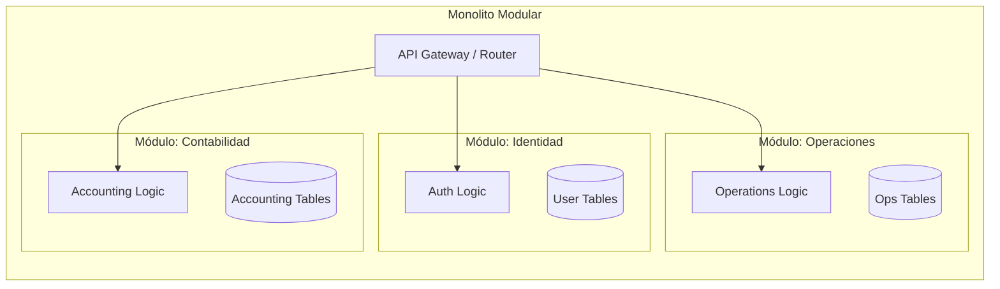

# ADR-001: Adopción de Monolito Distribuido Modular

## Estado
Aceptado

## Contexto
En el desarrollo de `finzapp_api`, nos enfrentamos a la decisión crítica de definir la arquitectura de despliegue y organización del código. Las opciones comunes son:
1.  **Monolito Tradicional (Capas):** Sencillo de desplegar, pero tiende a convertirse en una "Big Ball of Mud" con alto acoplamiento.
2.  **Microservicios:** Ofrece gran escalabilidad y autonomía de equipos, pero introduce una complejidad operativa significativa (red, latencia, consistencia eventual, orquestación) que puede paralizar a un equipo pequeño o mediano en etapas tempranas.

El objetivo es lograr la velocidad de iteración de un monolito y la modularidad de los microservicios, sin incurrir en la sobrecarga de infraestructura de estos últimos.

## Decisión
Se ha decidido adoptar una arquitectura de **Monolito Distribuido Modular** (Modular Monolith).

Esta arquitectura implica:
*   **Unidad de Despliegue Única:** La aplicación se despliega como un solo artefacto (ej. un contenedor Docker), simplificando la infraestructura y reduciendo costos.
*   **Límites Lógicos Estrictos:** Internamente, el código está organizado en módulos de negocio (Slices) que no comparten modelos de datos ni lógica interna directamente, sino que se comunican a través de interfaces públicas o eventos.
*   **Preparado para Extracción:** Los módulos están diseñados para ser extraídos a microservicios independientes con mínimo esfuerzo si la escala lo requiere en el futuro.

## Diseño Detallado

### Estructura de Módulos
En lugar de organizar por capas técnicas (Controllers, Services, DAOs), organizamos por dominios de negocio.

### Comunicación Inter-Modular
Para evitar el acoplamiento, los módulos no pueden importar clases internas de otros módulos.
*   **Sincrona:** A través de interfaces públicas (Fachadas) definidas en un `Shared Kernel` o expuestas explícitamente por el módulo.
*   **Asíncrona:** Preferiblemente mediante un Bus de Eventos en memoria (para procesos dentro del mismo proceso) o externo (para background tasks), desacoplando la ejecución.

## Consecuencias

### Positivas
*   **Simplicidad Operativa:** No se requiere orquestación compleja (Kubernetes) para empezar. CI/CD es directo.
*   **Refactorización Segura:** Los IDEs pueden refactorizar código a través de módulos fácilmente, algo difícil en microservicios distribuidos.
*   **Performance:** Las llamadas entre módulos son llamadas a funciones en memoria, eliminando la latencia de red.
*   **Evolutividad:** Facilita la transición a microservicios solo para los módulos que realmente lo necesiten (e.g., por carga de CPU específica).

### Negativas
*   **Escalado Horizontal Global:** Se escala toda la aplicación, no solo un módulo específico. Si el módulo de "Reportes" consume mucha RAM, hay que replicar todo el monolito.
*   **Riesgo de Acoplamiento:** Requiere disciplina estricta del equipo para no violar los límites modulares (se pueden usar herramientas como `archunit` o linters para reforzar esto).

## Cumplimiento
*   Las revisiones de código deben rechazar importaciones cruzadas entre módulos que no pasen por la API pública del módulo.
*   Cada módulo debe poseer sus propias tablas en la base de datos (o esquema lógico), evitando `JOINs` entre tablas de distintos módulos.
