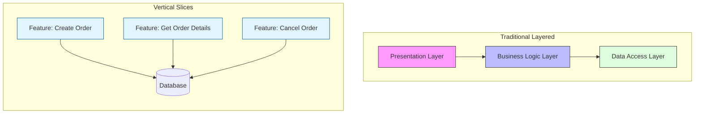

# ADR-002: Arquitectura de Slices Verticales (Vertical Slice Architecture)

## Estado
Aceptado

## Contexto
Las arquitecturas tradicionales por capas (Onion, Hexagonal, Clean) a menudo conducen a una "lasaña" de código: para añadir una funcionalidad simple, es necesario modificar múltiples archivos en capas horizontales (Controller, Service, Repository, DTO, Mapper). Esto aumenta la carga cognitiva, dificulta la cohesión y suele resultar en abstracciones innecesarias que no aportan valor al negocio.

El problema principal es el acoplamiento horizontal: cambios en la capa de datos a menudo requieren cambios en todas las capas superiores.

## Decisión
Adoptar la **Vertical Slice Architecture** (VSA). En lugar de agrupar el código por su tipo técnico (Capas), se agrupa por funcionalidad de negocio (Features).

## Diseño Detallado
Cada "slice" (rebanada) es una funcionalidad autocontenida que encapsula todo lo necesario para cumplir su propósito: desde la exposición de la API hasta el acceso a datos.

### Estructura de Directorios
```
src/
  features/
    identity/
      register_user/
        handler.py       # Controlador / Lógica
        command.py       # DTO de entrada
        repository.py    # Acceso a datos específico
      login_user/
        ...
    sales/
      create_order/
        ...
```

### Diagrama de Flujo



Cada slice puede decidir su propia complejidad interna. Un slice simple de lectura puede hacer una query directa a la base de datos (CQRS), mientras que un slice complejo de escritura puede usar un Domain Model rico.

## Consecuencias

### Positivas
*   **Alta Cohesión:** Todo el código relacionado con una funcionalidad está junto. Cambiar una feature implica tocar una sola carpeta.
*   **Bajo Acoplamiento:** Los slices no dependen entre sí. Eliminar una feature es tan simple como borrar su carpeta.
*   **Flexibilidad:** Permite usar diferentes patrones o librerías en diferentes slices según la necesidad (e.g., usar un ORM en unos y SQL puro en otros).

### Negativas
*   **Duplicación de Código:** Puede haber cierta duplicación de lógica de infraestructura o utilidades entre slices (aunque se mitiga con un `Shared Kernel`).
*   **Curva de Aprendizaje:** Requiere un cambio de mentalidad para desarrolladores acostumbrados a pensar en "Capas".

## Cumplimiento
*   Evitar crear "Servicios de Entidad" (e.g., `UserService` con 50 métodos). En su lugar, crear `RegisterUserHandler`, `UpdateUserProfileHandler`, etc.
*   El código compartido debe residir estrictamente en `src/shared` o `src/core`.
