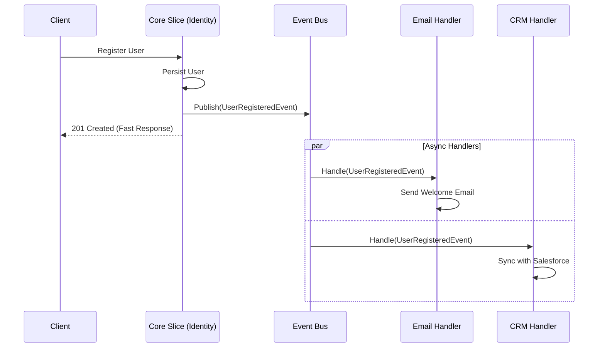

# ADR-003: Desacoplamiento de Módulos mediante Patrón Observer (Event Bus)

## Estado
Aceptado

## Contexto
En flujos críticos de negocio como el registro de usuarios o la creación de órdenes, a menudo se requieren múltiples acciones secundarias (efectos colaterales): enviar correos electrónicos de bienvenida, notificar a sistemas externos (CRM), actualizar estadísticas, o asignar recursos iniciales.

Si se implementan estas acciones de forma secuencial y síncrona dentro del servicio principal (ej. `RegisterUserHandler`), se generan varios problemas:
1.  **Alto Acoplamiento:** El servicio de registro depende directamente de los servicios de correo, CRM, etc.
2.  **Violación de SRP:** El servicio "sabe" demasiado.
3.  **Baja Resiliencia:** Si el servicio de correo falla, toda la transacción de registro falla, afectando la experiencia del usuario.
4.  **Latencia:** La suma de los tiempos de respuesta de los servicios externos ralentiza la respuesta al usuario.

## Decisión
Implementar el **Patrón Observer** a través de un **Bus de Eventos (Event Bus)** para manejar efectos secundarios.

El flujo principal (Core Domain Logic) solo es responsable de completar la transacción primaria y publicar un **Evento de Dominio** (ej. `UserRegisteredEvent`). Los suscriptores (Observers/Handlers) reaccionan a este evento de forma asíncrona o desacoplada.

## Diseño Detallado

### Flujo de Eventos

### Implementación Técnica
*   **Eventos:** Objetos inmutables (DTOs/Data Classes) que representan algo que *ya ocurrió* en el pasado (`UserRegistered`, `OrderPlaced`).
*   **Bus:** Un mediador que despacha eventos a sus suscriptores registrados. Puede ser en memoria (para simplicidad inicial) o persistente (RabbitMQ/Kafka) para mayor robustez.

## Consecuencias

### Positivas
*   **Desacoplamiento Total:** El productor del evento no conoce a los consumidores. Se pueden añadir nuevas reacciones (ej. "Enviar SMS") sin tocar el código de registro.
*   **Performance:** El usuario recibe respuesta inmediata. Los procesos pesados ocurren en segundo plano.
*   **Separación de Responsabilidades:** Cada handler se encarga de una única tarea.

### Negativas
*   **Consistencia Eventual:** El sistema deja de ser atómico globalmente. El usuario puede estar registrado pero aún no tener su correo de bienvenida.
*   **Complejidad de Debugging:** El flujo de ejecución no es lineal, lo que dificulta el rastreo de errores si no se cuenta con buen logging/tracing distribuido.

## Cumplimiento
*   Los eventos deben ser nombrados en pasado.
*   Los handlers deben ser idempotentes siempre que sea posible.
*   Se debe implementar un mecanismo de "Dead Letter Queue" o reintentos para manejar fallos en los suscriptores.
