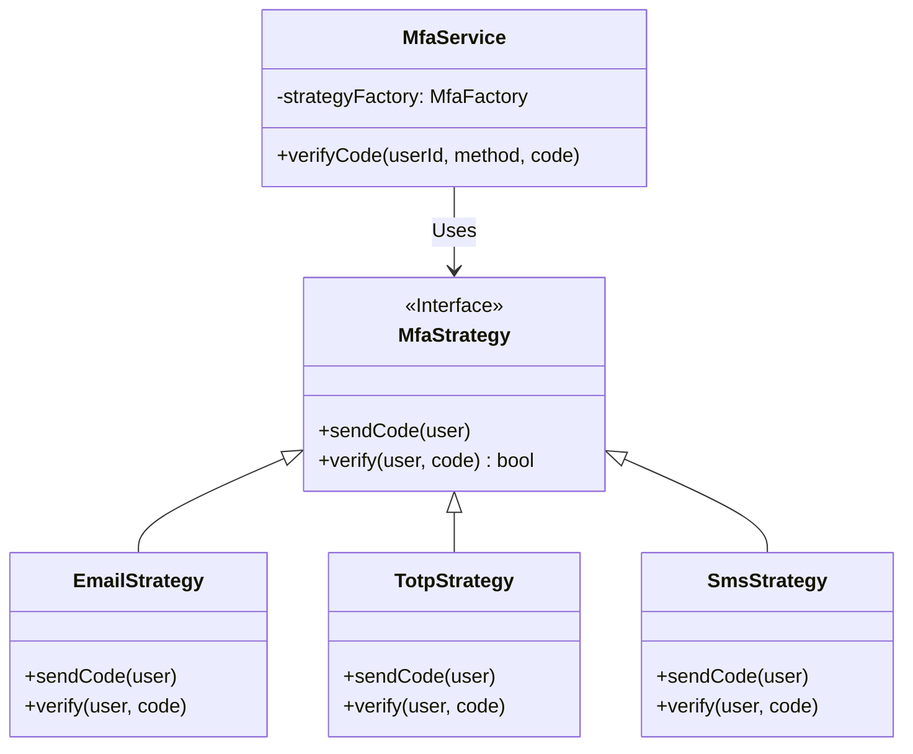

# ADR-004: Implementación de Múltiples Estrategias de Autenticación con Strategy Pattern

## Estado
Aceptado

## Contexto
La aplicación `finzapp_api` debe soportar múltiples métodos de autenticación de dos factores (MFA) para diferentes tipos de usuarios (Email, SMS, TOTP, Biometría). La implementación de estos métodos a menudo lleva a estructuras condicionales complejas (`if/else` o `switch`) que son difíciles de mantener y escalar.

El requerimiento de agregar nuevos métodos sin modificar el código existente es crucial para cumplir con el Principio Abierto/Cerrado (OCP).

## Decisión
Utilizar el **Patrón Strategy** para encapsular cada algoritmo de autenticación en una clase separada e intercambiable.

## Diseño Detallado

### Diagrama de Clases

### Flujo de Ejecución
1.  El `MfaService` recibe una petición de verificación (`method="sms"`).
2.  Consulta a un `Factory` o registro de estrategias para obtener la instancia correspondiente a "sms".
3.  Invoca el método `.verify()` de la estrategia recuperada.
4.  La estrategia encapsula toda la lógica específica (llamada a Twilio, validación de hash TOTP, etc.).

## Consecuencias

### Positivas
*   **Extensibilidad (OCP):** Agregar soporte para "FaceID" solo requiere crear `BiometricStrategy` y registrarla. No se toca el `MfaService`.
*   **Testabilidad:** Cada estrategia se puede probar unitariamente de forma aislada con sus propios mocks.
*   **Limpieza del Código:** Se eliminan los bloques condicionales gigantes.

### Negativas
*   **Complejidad Estructural:** Aumenta el número de clases y archivos en el proyecto.
*   **Overhead de Instanciación:** Si no se gestionan bien (ej. Singleton), la creación constante de estrategias puede tener un leve impacto en memoria.

## Cumplimiento
*   Todas las estrategias deben implementar la misma interfaz `MfaStrategy`.
*   La lógica de selección de la estrategia debe residir en una `Factory` o un contenedor de inyección de dependencias, no en el servicio de negocio.
