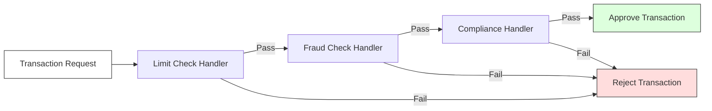

# ADR-005: Manejo de Validaciones Secuenciales Complejas mediante Chain of Responsibility

## Estado
Aceptado

## Contexto
En `finzapp_api`, los procesos de aprobación de transacciones (créditos, pagos) requieren una serie de validaciones secuenciales que deben cumplirse en orden específico (ej. verificar stock -> validar saldo -> comprobar límites diarios -> análisis de fraude).

Implementar estas reglas en un solo método (`processTransaction`) resulta en una "clase Dios" con cientos de líneas y alta complejidad ciclomática. Además, la necesidad de alterar el orden o desactivar reglas dinámicamente (ej. por tipo de cliente VIP) es casi imposible con código imperativo rígido.

## Decisión
Implementar el **Patrón Chain of Responsibility**.

Cada regla de validación se encapsula en una clase "Handler" independiente. Estos handlers se enlazan formando una cadena. La petición viaja a través de la cadena hasta que es rechazada o aprobada por todos los eslabones.

## Diseño Detallado

### Estructura de la Cadena



### Implementación Técnica
Se define una clase base abstracta `ValidationHandler` con un método `set_next(handler)` y un método abstracto `handle(request)`.

```python
class ValidationHandler(ABC):
    def set_next(self, handler):
        self._next_handler = handler
        return handler

    def handle(self, request):
        if self._next_handler:
            return self._next_handler.handle(request)
        return True
```

## Consecuencias

### Positivas
*   **Single Responsibility Principle:** Cada clase valida una sola cosa.
*   **Flexibilidad Dinámica:** Se pueden construir cadenas diferentes en tiempo de ejecución (ej. `VIPChain` vs `StandardChain`).
*   **Reusabilidad:** Los handlers (ej. `FraudCheck`) se pueden reutilizar en otros flujos.

### Negativas
*   **Latencia Acumulada:** Si la cadena es muy larga, puede haber un impacto en performance (aunque despreciable en memoria).
*   **Dificultad de Rastreo:** Puede ser difícil saber qué handler exacto rechazó la petición sin un buen sistema de logs/errores estructurados.

## Cumplimiento
*   Los handlers no deben mutar el estado de la petición, solo validarla (aunque en algunos casos pueden enriquecerla).
*   Si un handler rechaza, debe retornar una excepción o un resultado de error específico que identifique la causa.
