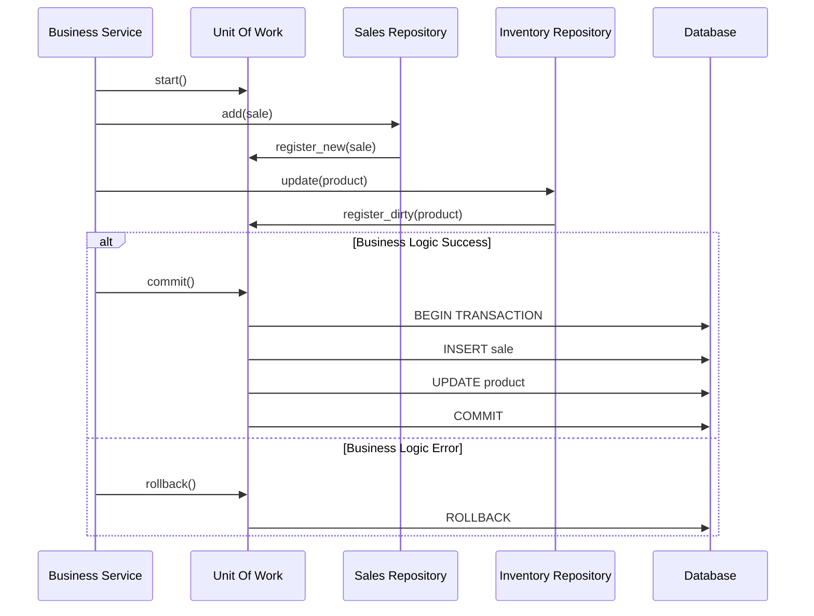

# ADR-006: Garantía de Consistencia Transaccional mediante Unit of Work

## Estado
Aceptado

## Contexto
En casos de uso complejos de negocio (ej. "Procesar Compra"), se requiere modificar múltiples agregados o tablas en la base de datos (Inventario, Ventas, Contabilidad).

Si se gestionan las transacciones de forma manual o dispersa en cada repositorio, existe un alto riesgo de **inconsistencia de datos** ante fallos parciales (ej. se descuenta el stock pero falla el registro de la venta). Además, pasar el objeto de conexión/sesión de base de datos entre servicios acopla la lógica de negocio a la infraestructura de persistencia.

## Decisión
Implementar el **Patrón Unit of Work (UoW)** para gestionar la atomicidad de las transacciones de negocio.

El UoW mantiene una lista de objetos afectados por una transacción de negocio y coordina la escritura de cambios y la resolución de problemas de concurrencia.

## Diseño Detallado

### Flujo de Transacción



### Implementación Técnica
En Python, se implementa preferiblemente mediante **Context Managers** (`async with`):

```python
async with unit_of_work:
    await unit_of_work.sales.add(sale)
    await unit_of_work.inventory.decrease_stock(product_id, qty)
    # Commit automático al salir del bloque si no hay excepciones
```

El UoW es el único punto donde se inyecta la sesión de base de datos, manteniendo los repositorios y servicios libres de gestión de transacciones explícita.

## Consecuencias

### Positivas
*   **Atomicidad Garantizada:** O todas las operaciones tienen éxito, o ninguna se aplica.
*   **Abstracción de Persistencia:** Desacopla la lógica de negocio de los detalles de `commit/rollback`.
*   **Testabilidad:** Facilita el mocking de la capa de transacción completa.

### Negativas
*   **Complejidad de Implementación:** Requiere crear una capa de abstracción sobre el ORM o driver de base de datos.
*   **Bloqueos:** Transacciones largas pueden bloquear recursos en la base de datos. Se debe cuidar la duración del bloque `with`.

## Cumplimiento
*   Nunca llamar a `commit()` dentro de un repositorio individual.
*   Toda operación de escritura debe estar envuelta en un bloque `UnitOfWork`.
