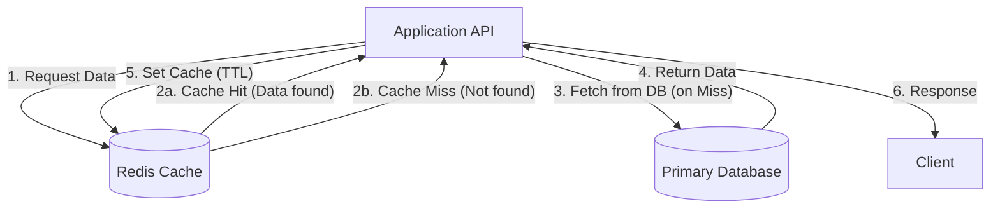

# ADR-007: Estrategia de Caching con Redis (Cache-Aside)

## Estado
Aceptado

## Contexto
En `finzapp_api`, las consultas repetitivas de lectura (e.g., Catálogo de Productos, Perfil de Usuario) representan una carga significativa para la base de datos relacional principal (PostgreSQL). Esto incrementa la latencia y limita la escalabilidad horizontal del sistema.

Sin una estrategia de caché, cada petición de lectura golpea el disco, lo cual es ineficiente y costoso.

## Decisión
Implementar una estrategia de **Cache-Aside** utilizando **Redis** como almacén de clave-valor en memoria.

## Diseño Detallado

### Patrón Cache-Aside

### Serialización y Claves
*   **Formato:** JSON (para legibilidad y compatibilidad) o MsgPack (para eficiencia).
*   **Claves:** `v1:user:{id}:profile`, `v1:product:{id}:details`.
*   **TTL (Time To Live):** Cada entrada debe tener un tiempo de expiración por defecto para evitar datos obsoletos indefinidamente.

### Invalidación
Para asegurar la consistencia, cuando ocurre una escritura (Update/Delete):
1.  Se actualiza la base de datos.
2.  Se invalida (borra) la entrada correspondiente en Redis inmediatamente.
3.  La próxima lectura repoblará el caché con el dato fresco.

## Consecuencias

### Positivas
*   **Rendimiento:** Reducción drástica de la latencia (< 5ms para lecturas en caché).
*   **Escalabilidad:** Reduce la carga (CPU/IO) en la base de datos primaria, permitiendo que esta se enfoque en escrituras.
*   **Costo:** Redis es más barato de escalar para lecturas simples que una base de datos relacional.

### Negativas
*   **Complejidad Operativa:** Requiere gestionar un nuevo componente de infraestructura (Redis).
*   **Consistencia Eventual:** Existe una pequeña ventana de tiempo donde el caché puede tener datos viejos (Stale Data), especialmente en sistemas distribuidos.

## Cumplimiento
*   Datos críticos de transacción (ej. saldo bancario antes de una transferencia) **NO** deben leerse del caché, sino directamente de la base de datos con bloqueo.
*   Siempre usar TTL.
