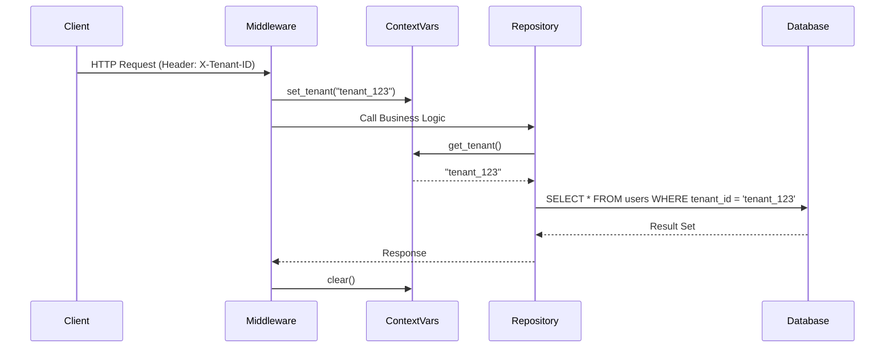

# ADR-009: Aislamiento de Datos en Entorno Multi-Tenant (SaaS)

## Estado
Aceptado

## Contexto
`finzapp_api` opera como una plataforma SaaS (Software as a Service) donde múltiples clientes (empresas) comparten la misma infraestructura y base de datos.
El riesgo de **fugas de datos** (Cross-Tenant Data Leakage) es crítico. Si una query olvida filtrar por `tenant_id`, un cliente podría ver los datos de su competidor.

Confiar en que cada desarrollador recuerde añadir `WHERE tenant_id = ?` en cada consulta SQL es una estrategia frágil y propensa a errores humanos.

## Decisión
Implementar un **Aislamiento Lógico mediante Middleware de Contexto y Row Level Security (RLS)** (o filtros globales de ORM).

El `tenant_id` se extrae una sola vez en la capa de transporte (HTTP) y se inyecta en un contexto global (`ContextVar`). La capa de persistencia aplica el filtro automáticamente sin intervención del programador.

## Diseño Detallado

### Flujo de Contexto

### Implementación Técnica
*   **Identificación:** El tenant se identifica mediante `Subdominio`, `Header` o claim en el `JWT`.
*   **Propagación:** Se utiliza `contextvars` de Python para propagar el ID a través de llamadas asíncronas.
*   **Filtrado:**
    *   *Opción A (ORM):* Global Query Filter (ej. SQLAlchemy `before_cursor_execute`).
    *   *Opción B (DB):* PostgreSQL Row Level Security (RLS) policies.

## Consecuencias

### Positivas
*   **Seguridad por Diseño:** Es imposible olvidar el filtro, ya que está integrado en la infraestructura.
*   **Simplicidad del Código:** Los desarrolladores escriben `select * from users` y el sistema se encarga del resto.
*   **Escalabilidad:** Permite alojar miles de tenants en una sola instancia de DB.

### Negativas
*   **Complejidad de Debugging:** Las queries reales ejecutadas son diferentes a las escritas en el código.
*   **Migraciones de Datos:** Mover un tenant a otra base de datos o fragmentar (sharding) es más complejo que con bases de datos separadas.

## Cumplimiento
*   Todas las tablas de negocio deben tener la columna `tenant_id` indexada.
*   El middleware debe rechazar cualquier petición sin un contexto de tenant válido (401/403).
