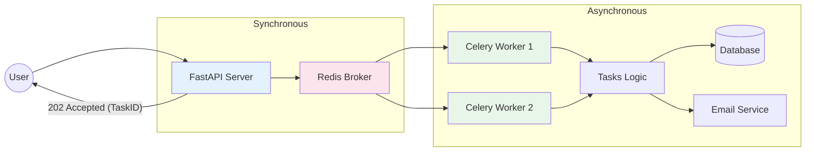

# ADR-010: Procesamiento Asíncrono de Tareas Pesadas (Celery + Redis)

## Estado
Aceptado

## Contexto
Ciertas operaciones de negocio, como la generación de reportes financieros en PDF, el envío masivo de correos electrónicos o la importación de grandes archivos CSV, son intensivas en CPU y I/O.
Ejecutar estas tareas de forma síncrona dentro del ciclo de vida de una petición HTTP (Request-Response) bloquea el hilo de ejecución, causando timeouts, mala experiencia de usuario y potenciales caídas del servidor por agotamiento de recursos.

## Decisión
Implementar un sistema de **Colas de Tareas Asíncronas** utilizando **Celery** como framework y **Redis** como broker de mensajes.

## Diseño Detallado

### Arquitectura Productor-Consumidor

### Flujo de Ejecución
1.  **API:** Recibe la petición, valida los datos y encola un mensaje en Redis (`task.apply_async()`).
2.  **API:** Retorna inmediatamente un HTTP `202 Accepted` con un `task_id`.
3.  **Worker:** Un proceso separado (Celery) toma el mensaje de la cola y ejecuta la función pesada.
4.  **Resultado:** El worker actualiza el estado de la tarea (SUCCESS/FAILURE) en un Backend de Resultados (Redis/DB).

## Consecuencias

### Positivas
*   **Resiliencia:** Si el worker falla, la tarea se reintenta automáticamente (configurable con `retry_backoff`).
*   **Escalabilidad:** Se pueden añadir más workers en servidores distintos para procesar más tareas en paralelo sin tocar la API.
*   **UX:** El usuario percibe una respuesta instantánea.

### Negativas
*   **Complejidad de Infraestructura:** Se requiere mantener instancias adicionales (Workers, Redis, Flower para monitoreo).
*   **Dificultad de Debugging:** Los errores ocurren "en otro lugar" y no en el stack trace de la petición HTTP.

## Cumplimiento
*   Ninguna tarea que tarde más de 500ms debe ejecutarse en el hilo principal de la API.
*   Las tareas deben ser idempotentes siempre que sea posible.
