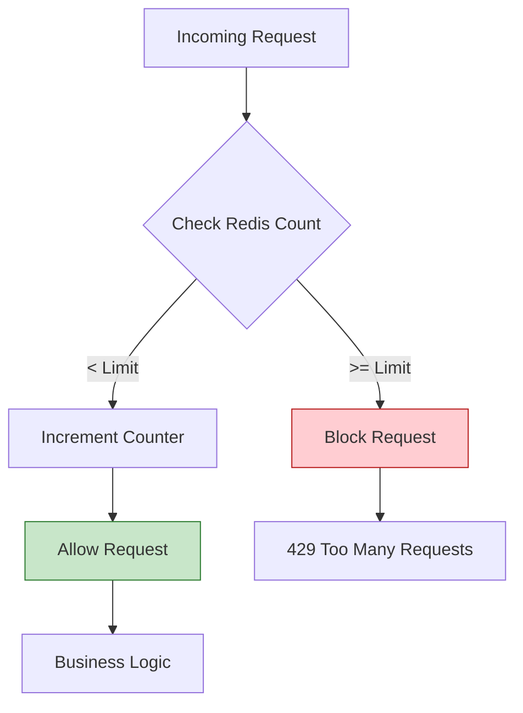

# ADR-011: Protección de Infraestructura mediante Rate Limiting Dinámico

## Estado
Aceptado

## Contexto
Los endpoints públicos de la API son vulnerables a diversos tipos de abuso:
1.  **Ataques de Fuerza Bruta / Credential Stuffing:** Bots probando miles de combinaciones de usuario/contraseña.
2.  **Denegación de Servicio (DDoS) a Capa de Aplicación:** Agotamiento de recursos (conexiones a DB, CPU) por exceso de peticiones.
3.  **Errores de Clientes:** Bucles infinitos en integraciones de terceros que saturan la API accidentalmente.

Sin un mecanismo de control, un solo actor malicioso o defectuoso puede degradar el servicio para todos los usuarios.

## Decisión
Implementar un sistema de **Rate Limiting (Limitación de Tasa)** a nivel de middleware, utilizando **Redis** como almacén de estado rápido.

## Diseño Detallado

### Algoritmo: Sliding Window (Ventana Deslizante)
A diferencia de una ventana fija (que permite ráfagas al cambio de minuto), la ventana deslizante suaviza el tráfico y es más justa.

### Implementación Técnica
*   **Almacén:** Redis (por su velocidad de milisegundos y operaciones atómicas).
*   **Clave:** `ratelimit:{ip}:{endpoint}` o `ratelimit:{user_id}:{action}`.
*   **Respuesta:** HTTP `429 Too Many Requests` incluyendo headers informativos:
    *   `X-RateLimit-Limit`: Límite total.
    *   `X-RateLimit-Remaining`: Peticiones restantes.
    *   `Retry-After`: Segundos a esperar antes de reintentar.

### Atomicidad con LUA
Para evitar condiciones de carrera (check-then-set), la lógica de incremento y verificación se ejecuta mediante scripts LUA en Redis o comandos atómicos.

## Consecuencias

### Positivas
*   **Protección de Recursos:** Garantiza que la CPU y la base de datos no se saturen por tráfico abusivo.
*   **Disponibilidad:** Asegura un ancho de banda justo para todos los usuarios legítimos.
*   **Seguridad:** Mitiga ataques de fuerza bruta en el login.

### Negativas
*   **Falsos Positivos:** Si varios usuarios comparten una IP (NAT), pueden bloquearse mutuamente (se mitiga usando Rate Limit por Usuario autenticado).
*   **Latencia Adicional:** Agrega un pequeño overhead (round-trip a Redis) a cada petición.

## Cumplimiento
*   Todos los endpoints públicos (sin autenticación) deben tener un límite estricto por IP.
*   Los endpoints autenticados deben tener límites por `user_id`.
