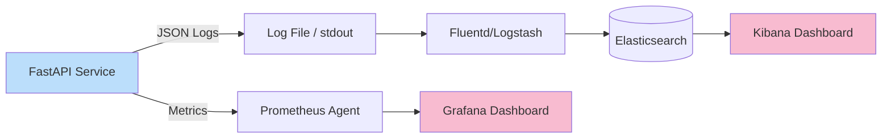

# ADR-013: Observabilidad Completa mediante Logging Estructurado y Métricas

## Estado
Aceptado

## Contexto
En un sistema distribuido y de alto tráfico como `finzapp_api`, los fallos en producción (latencia, errores 500) son inevitables.
Sin embargo, detectar la causa raíz en logs de texto plano dispersos en múltiples servidores es una tarea titánica y lenta.
El desconocimiento del estado real del sistema ("¿Por qué está lento el endpoint de pagos?") afecta la confianza del cliente y el SLA.

## Decisión
Implementar una estrategia de **Observabilidad** basada en tres pilares: Logging Estructurado (JSON), Métricas (Prometheus) y Trazabilidad Distribuida (Correlation IDs).

## Diseño Detallado

### Pipeline de Observabilidad



### Logging Estructurado (JSON)
En lugar de `print("Error en usuario")`, se emiten objetos JSON que las herramientas de análisis pueden indexar y filtrar.

```json
{
  "timestamp": "2023-10-27T10:00:00Z",
  "level": "ERROR",
  "correlation_id": "abc-123-xyz",
  "module": "payments",
  "message": "Payment gateway timeout",
  "user_id": 451,
  "stack_trace": "..."
}
```

### Trazabilidad (Correlation ID)
Cada petición HTTP entrante recibe un ID único (`X-Request-ID`) en el Load Balancer o Middleware. Este ID se propaga a todos los logs y llamadas a servicios internos, permitiendo reconstruir la "historia" completa de una transacción.

## Consecuencias

### Positivas
*   **MTTR (Mean Time To Repair):** Se reduce drásticamente el tiempo para encontrar bugs.
*   **Alertas Proactivas:** Se puede configurar una alerta si la latencia promedio sube de 200ms, antes de que los usuarios se quejen.
*   **Debugging Distribuido:** Posibilidad de rastrear una petición a través de microservicios o workers.

### Negativas
*   **Volumen de Datos:** El logging detallado puede generar gigabytes de datos diarios, incrementando costos de almacenamiento (ELK/Datadog).
*   **Overhead:** La serialización de logs y recolección de métricas consume una pequeña fracción de CPU.

## Cumplimiento
*   Prohibido usar `print()` en producción. Usar siempre el logger configurado.
*   Todos los logs de error deben incluir el contexto (user_id, tenant_id) si está disponible.
