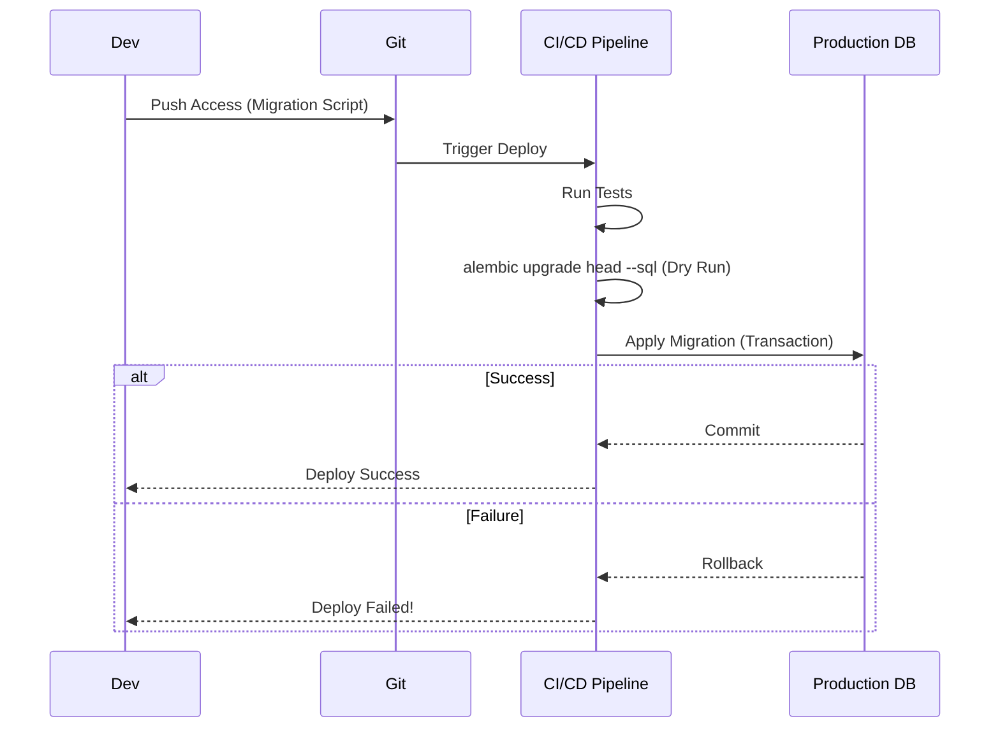

# ADR-014: Gestión Segura de Esquemas de Base de Datos (Zero-Downtime Migrations)

## Estado
Aceptado

## Contexto
En un sistema en producción con alta disponibilidad, los cambios en el esquema de la base de datos (e.g., agregar una columna, renombrar una tabla) son operaciones de alto riesgo.
Un simple `ALTER TABLE` en una tabla con millones de registros puede bloquear la tabla completa (Table Lock), deteniendo el servicio durante minutos u horas.
Además, la falta de control de versiones en los esquemas SQL hace imposible saber el estado exacto de la base de datos en diferentes entornos (Dev, Staging, Prod).

## Decisión
Utilizar **Alembic** para el control de versiones de la base de datos y adoptar el patrón **Expand-Migrate-Contract** para cambios destructivos.

## Diseño Detallado

### Flujo de Trabajo con Alembic
Todo cambio en la estructura de la base de datos debe ser un script de migración en el repositorio.

### Patrón Expand-Migrate-Contract
Para evitar downtime al modificar datos (ej. renombrar columna `addr` a `address`):
1.  **Expand:** Agregar columna `address` (nullable). El código escribe en ambas, lee de `addr`.
2.  **Migrate:** Script en background copia datos de `addr` a `address`.
3.  **Contract:** El código lee de `address`. Se borra `addr`.

Este proceso asegura que la aplicación nunca deje de funcionar durante el despliegue.

## Consecuencias

### Positivas
*   **Reproducibilidad:** Se puede levantar un entorno de desarrollo idéntico a producción en segundos.
*   **Seguridad:** Los cambios se prueban en CI antes de tocar producción. Rollbacks automáticos en caso de error.
*   **Zero Downtime:** Los usuarios no notan que se está actualizando la base de datos.

### Negativas
*   **Disciplina:** Requiere más pasos que simplemente ejecutar un SQL en la consola.
*   **Complejidad:** Los cambios destructivos requieren múltiples despliegues (fases).

## Cumplimiento
*   Prohibido ejecutar DDL (Data Definition Language) manualmente en producción.
*   Las migraciones deben ser revisadas por un par (Code Review) prestando atención a posibles bloqueos de tabla.
