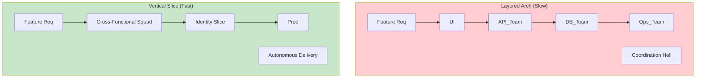

# ADR-015: Alineación de Arquitectura con Dominios de Negocio (Agilidad)

## Estado
Aceptado

## Contexto
En organizaciones en crecimiento, diferentes áreas de negocio (e.g., Marketing, Operaciones, Riesgos) evolucionan a ritmos dispares.
Una arquitectura monolítica tradicional "por capas" (UI, Lógica, Datos) acopla horizontalmente estas áreas. Un cambio en la lógica de "Riesgos" puede requerir coordinación y despliegue conjunto con el equipo de "Marketing", frenando la innovación y aumentando el riesgo de regresiones.

El objetivo es reducir el **Time-to-Market** y permitir que los equipos trabajen de forma autónoma.

## Decisión
Adoptar una arquitectura basada en **Dominios de Negocio** (Domain-Driven Design / Vertical Slices) que refleje la estructura y los flujos de valor de la empresa (Ley de Conway).

## Diseño Detallado

### Desacoplamiento de Ciclos de Vida
Cada "Slice" o módulo de negocio es una unidad independiente que puede ser desarrollada, probada y desplegada (lógicamente) por un equipo multidisciplinario (Squad).

### Mapeo de Valor
La estructura de carpetas y módulos debe responder a preguntas de negocio, no técnicas.
*   `src/features/loans` (no `src/services/LoanService.java`)
*   `src/features/onboarding`

## Consecuencias

### Positivas
*   **Autonomía:** Un equipo puede iterar en su dominio sin pedir permiso a otros.
*   **Resiliencia:** Un fallo en el módulo de "Notificaciones" no tumba el "Core Bancario".
*   **Cognitive Load:** Los desarrolladores solo necesitan entender el dominio en el que trabajan, no todo el sistema.

### Negativas
*   **Duplicación:** Puede haber código repetido entre dominios (se acepta como el costo de la independencia).
*   **Gobernanza:** Se requiere un equipo de Plataforma o Arquitectura que mantenga los estándares transversales (logging, auth).

## Cumplimiento
*   Los límites de los módulos deben definirse junto con los expertos de dominio (Product Owners), no solo por desarrolladores.
*   Evitar compartir modelos de base de datos entre dominios.
